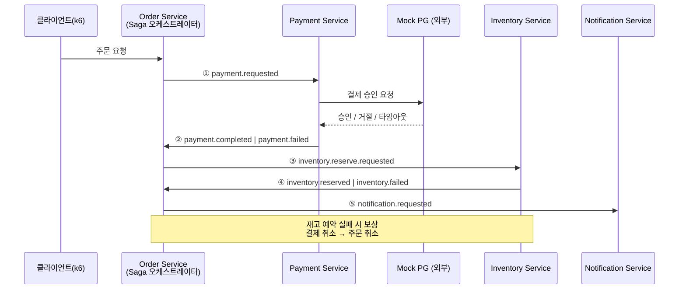

# Payment Lab

> 결제 도메인을 소재로 백엔드 핵심 CS 개념(분산 트랜잭션, 동시성 제어, 이벤트 기반 아키텍처, 성능 최적화)을 직접 구현하고 검증해보기 위한 개인 학습 프로젝트입니다.

단순히 "결제 API 만들기"가 목표가 아니라, **결제라는 도메인이 왜 어려운지**를 몸으로 익히는 것이 목표입니다. 결제는 돈이 오가기 때문에 멱등성, 동시성 제어, 장애 대응이 필수인 대표적인 도메인이고, 그래서 Saga · 분산 락 · 외부 API 방어 · 이벤트 기반 통신 같은 개념들을 학습하기에 가장 현실감 있는 소재라고 생각했습니다.

여기에 더해, 쌓인 결제 실패/이상거래 로그를 검색하고 AI가 원인 분석을 도와주는 운영 지원 기능(RAG 기반 Agent)까지 붙여서, 최근 백엔드 개발에서 요구되는 AI 연동 경험도 함께 쌓아보려 합니다.

---

## 문서

| 문서 | 내용 |
|---|---|
| [실행 로드맵](docs/roadmap.md) | 단계별 태스크, 설계 결정 근거, CI/CD 구성, 문서 체계 |
| [문서 인덱스](docs/README.md) | 전체 문서 목록과 읽는 순서 |
| [Spring Boot 4 노트](docs/troubleshooting/00-spring-boot-4.md) | 0단계에서 겪은 문제와 해결 기록 |

---

## 로컬 개발 환경 설정

DB 자격증명은 저장소에 평문으로 커밋하지 않습니다. 로컬에서 `docker-compose.yml`(PostgreSQL 인스턴스 3개)과 각 서비스(`application-dev.yml`)를 띄우기 전에:

```bash
cp .env.example .env            # 복사한 뒤 DB_USERNAME/DB_PASSWORD를 본인 로컬 값으로 채울 것
export $(grep -v '^#' .env | xargs)   # 서비스(./gradlew :order-service:bootRun 등)를 직접 띄울 때 필요
docker compose up -d             # PostgreSQL 3개 + Redis
```

`.env`는 `.gitignore`에 등록돼 있어 커밋되지 않습니다. 자세한 내용은 `.env.example` 주석 참고.

---

## 왜 이 기술 스택을 선택했는가

기술을 먼저 정하고 프로젝트를 끼워 맞춘 게 아니라, "결제 시스템을 안전하게 만들려면 무엇이 필요한가"를 하나씩 따라가다 보니 자연스럽게 이 스택이 됐습니다.

### Spring Boot + JPA + PostgreSQL
결제 데이터는 정합성이 생명이라 트랜잭션과 관계형 모델이 확실한 RDBMS가 맞다고 판단했습니다. Spring Boot는 AOP를 통해 멱등성 체크나 분산 락 같은 부가 로직을 어노테이션 하나로 깔끔하게 분리할 수 있어서, 핵심 로직과 인프라성 로직을 명확히 나눠서 학습하기에 좋았습니다.

### Redis + Redisson
캐싱 성능 실험(TPS/응답속도 비교)을 해보고 싶었고, 동시에 "여러 서버 인스턴스가 동시에 같은 주문을 처리하면 어떻게 될까"라는 분산 락 문제도 직접 겪어보고 싶었습니다. Redisson의 `RLock`은 실무에서도 가장 널리 쓰이는 분산 락 구현체라 선택했습니다. 결제 요청의 중복 처리를 막는 멱등성 키 저장소로도 같이 활용합니다.

다만 Redis 단독으로는 Redis가 죽는 순간 중복 결제가 그대로 뚫리기 때문에, 멱등성은 **Redis(빠른 차단) + DB 유니크 제약(최종 방어)** 2단 구조로 갑니다.

### Kafka
결제 흐름은 "주문 생성 → 결제 처리 → 재고 예약 → 알림 발송"처럼 여러 단계로 나뉘는데, 이걸 동기 호출 체인으로 엮으면 한 서비스가 죽었을 때 전체가 멈춰버립니다. 이 문제를 이벤트 기반 비동기 통신으로 풀어내는 경험, 그리고 그 과정에서 필연적으로 마주치는 Saga 패턴(분산 트랜잭션 보상 처리)을 직접 구현해보고 싶어서 선택했습니다.

### Resilience4j
결제 서비스는 반드시 외부 PG사(Payment Gateway)를 호출해야 하는데, 외부 시스템은 언제든 느려지거나 죽을 수 있습니다. Circuit Breaker, Retry, TimeLimiter를 조합해서 "외부 장애가 우리 서비스 전체 장애로 번지지 않게 막는" 방어 로직을 학습하기 위해 도입했습니다.

### Actuator + Micrometer + Prometheus
기능을 구현하는 것과 그 기능이 실제로 얼마나 빠른지 숫자로 증명하는 것은 다른 문제입니다. 캐싱 적용 전/후, 락 전략 변경 전/후를 TPS와 p95/p99 응답속도로 직접 비교해보기 위해 표준적인 모니터링 스택을 구성했습니다.

### Elasticsearch + Kibana (ELK)
결제 실패나 이상거래 로그는 텍스트 검색이 빈번하게 필요한 데이터입니다. 로그를 ES에 적재하고 Kibana로 시각화하면서 검색 엔진의 역할을 익히고, 동시에 이 ES를 RAG의 벡터 스토어로도 재활용해서 인프라를 이중으로 활용해보고 싶었습니다.

### Spring AI + RAG
결제 실패가 발생했을 때 "왜 실패했는지, 과거에 비슷한 사례가 있었는지"를 사람이 로그를 뒤져가며 찾는 대신, 과거 사례를 검색(Retrieval)해서 LLM이 원인 분석과 대응 가이드를 생성(Generation)하도록 만들어보고 싶었습니다.

RAG에는 모델이 **두 개** 필요합니다. 문서와 질의를 벡터로 바꾸는 Embedding Model, 검색 결과로 답변을 만드는 Chat Model입니다. Anthropic API는 채팅 모델만 제공하므로 임베딩은 로컬 ONNX 기반(`spring-ai-starter-model-transformers`)을 함께 씁니다.

### GitHub Actions + Trivy + Semgrep + CodeRabbit
사람이 기억으로 지키는 규칙은 결국 깨집니다. "금액에 `double`을 쓰지 않는다", "이벤트는 Outbox를 경유한다" 같은 설계 규칙과 보안 취약점을 PR 단계에서 기계가 막도록 구성했습니다. Critical/High 취약점이 탐지되면 빌드가 실패하고 병합이 차단됩니다.

### Kubernetes
로컬 docker-compose로 개발한 서비스들을 실제로 오케스트레이션 환경에 배포하면서 겪는 문제(설정 관리, 헬스체크, graceful shutdown 등)를 경험하기 위한 최종 단계입니다.

---

## MSA 구성 방식

Saga 패턴 자체가 "여러 서비스에 걸친 트랜잭션을 어떻게 일관성 있게 처리할 것인가"를 다루는 패턴이기 때문에, 서비스를 나누지 않으면 애초에 공부할 이유가 없어집니다. 그래서 실무처럼 수십 개로 쪼개는 대신, **개념 학습에 필요한 최소 단위인 4개 서비스**로 구성했습니다.

### Saga 흐름 (오케스트레이션)

Order Service가 오케스트레이터입니다. **각 단계의 결과가 모두 Order로 돌아오고, Order가 다음 단계를 결정합니다.** 각 서비스가 이벤트를 보고 알아서 반응하는 코레오그래피 방식이 아닙니다.



오케스트레이션을 택한 이유는 **Saga의 현재 상태를 한 곳에서 추적할 수 있기 때문**입니다. 코레오그래피는 서비스 추가가 쉽지만, 어느 주문이 어느 단계에서 멈췄는지 알아내려면 모든 서비스의 로그를 뒤져야 합니다. 학습 목적에서는 상태가 눈에 보이는 쪽이 낫다고 판단했습니다.

### 서비스별 역할

| 서비스 | 역할 | 하지 않는 것 | 학습하는 개념 |
|---|---|---|---|
| **Order Service** | Saga 조율, 주문 생명주기 관리 | 결제 승인 판단, 재고 확인 | Saga 오케스트레이션, Transactional Outbox |
| **Payment Service** | Mock PG 연동, 결제 처리 | 주문 상태 변경, 재고 차감 | 멱등성 키 처리, 분산 락, Resilience4j |
| **Inventory Service** | 재고 예약 / 확정 / 해제 | 결제 성공 여부 해석 | DB 락(비관적/낙관적), 동시성 제어 |
| **Notification Service** | 결제 결과 알림 발송 | Saga 흐름에 개입 | Kafka 이벤트 컨슈밍, 비동기 처리 |

"하지 않는 것"을 함께 적은 이유는, 서비스 경계가 흐려지는 건 대부분 **남의 일을 대신 해주면서** 시작되기 때문입니다.

### 재고는 차감이 아니라 예약

재고를 즉시 차감하면 보상이 불가능한 상황이 생깁니다. 주문 A가 마지막 재고를 차감했는데 이후 단계가 실패해서 복구하려는 사이, 주문 B가 그 재고를 가져가버리면 A는 되돌릴 수 없습니다.

그래서 `available` / `reserved` 두 값으로 나눠 관리합니다.

```
예약: available -= n, reserved += n   (Saga 진행 중)
확정: reserved -= n                   (Saga 성공)
해제: reserved -= n, available += n   (Saga 실패 → 보상)
```

예약에는 만료 시간을 둬서, Saga가 죽어도 스케줄러가 회수하게 만듭니다.

### DB와 공통 레이어

실무 MSA처럼 완전히 독립된 DB를 각 서비스마다 두는 것이 이상적이지만, 이 프로젝트는 학습이 목적이라 Order/Payment는 별도 DB로 분리하고 Inventory/Notification은 초기엔 같은 DB를 공유하는 식으로 리소스를 절약했습니다.

ES + Kibana, Prometheus + Grafana, AI Agent(RAG)는 특정 서비스에 속하지 않는 **공통 관측/부가 기능 레이어**로 두어, 서비스 개수를 늘리지 않고도 로컬 환경(16GB RAM)에서 무리 없이 돌아가도록 구성했습니다.

---

## 핵심 기능

1. **결제 Saga 처리** — 주문 생성부터 결제, 재고 예약, 알림까지 이어지는 흐름을 Kafka 이벤트 기반으로 orchestration하고, 중간 단계 실패 시 보상 트랜잭션으로 롤백
2. **결제 요청 멱등성 보장** — 동일한 결제 요청이 중복으로 들어와도 한 번만 처리되도록 Redis + DB 2단 검증. Redis 장애 시에도 이중 결제가 나지 않는 것까지 테스트로 검증
3. **이벤트 발행의 원자성** — Transactional Outbox 패턴으로 "DB는 커밋됐는데 이벤트는 유실" 문제 차단
4. **재고 동시성 제어** — 같은 상품에 동시 요청이 몰릴 때의 정합성 문제를 락 없음 / 비관적 락 / 낙관적 락 / 분산 락 4가지로 구현하고 TPS와 p95를 직접 비교
5. **외부 PG 장애 방어** — Circuit Breaker/Retry/TimeLimiter/Bulkhead로 외부 결제 API 장애가 전체 서비스로 전파되지 않도록 격리. 방어 로직 없는 버전과 비교해 효과를 수치로 확인
6. **캐싱 성능 개선 실측** — Redis 캐싱 적용 전/후의 TPS와 응답속도(p50/p95/p99)를 k6로 측정. Cache Stampede 재현과 방어까지 포함
7. **결제 이상거래 로그 검색 및 AI 분석** — 결제 실패/이상거래 로그를 Elasticsearch에 적재하고, RAG 기반 AI Agent가 과거 유사 사례를 검색해 원인 분석과 대응 가이드를 제시. 답변에 근거 문서 ID를 함께 반환해 환각을 검증 가능하게 구성
8. **실시간 모니터링** — Prometheus + Grafana로 서비스별 처리량, 응답속도, 서킷 브레이커 상태를 실시간 관찰
9. **CI 품질 게이트** — PR마다 Semgrep(SAST) + Trivy(SCA) 실행. Critical/High 탐지 시 빌드 실패로 병합 차단. CodeRabbit이 설계 규칙 위반을 조언 형태로 리뷰
10. **Kubernetes 배포와 CD** — 경량 K8s 클러스터(kind/k3d)에 배포하고, main 머지 시 이미지 빌드·스캔·푸시가 자동으로 도는 파이프라인 구성

---

## 진행 현황

| 단계 | 내용 | 아키텍처 | 상태 |
|---|---|---|---|
| **0** | 기반 세팅 (Gradle, Flyway, Testcontainers, 구조화 로깅) | 모놀리식 | ✅ 완료 |
| **R** | 리포지토리 + CI 파이프라인 (SAST/SCA/CodeRabbit) | 모놀리식 | ✅ 완료 |
| **1** | 모놀리식 결제 코어 (멱등성, DB 락, 캐싱) | 모놀리식 | ✅ 완료 |
| **2** | **MSA 전환** + Kafka Saga (Outbox, 보상 트랜잭션) | MSA (4개 서비스) | 🚧 진행 중 (2-A) |
| **3** | Resilience4j 방어 로직 + k6 성능 검증 | MSA | |
| **4** | ELK 스택 + RAG/Agent | MSA + 관측 레이어 | |
| **5** | Kubernetes 배포 + CD 파이프라인 | K8s | |

2단계가 모놀리식에서 MSA로 넘어가는 전환점입니다. 1단계까지는 패키지만 나뉜 하나의 애플리케이션이고, 2단계에서 각 패키지가 독립 프로세스가 되면서 트랜잭션 경계가 깨집니다. Saga·Outbox·컨슈머 멱등성이 전부 2단계에 몰려 있는 이유입니다.

각 단계의 세부 태스크와 완료 기준은 [실행 로드맵](docs/roadmap.md)에 있습니다.

---

## 기술 스택

**언어 · 프레임워크**
`Java 21` `Spring Boot 4.1` `Spring Data JPA` `Hibernate 7`

**데이터 · 메시징**
`PostgreSQL` `Flyway` `Redis` `Redisson` `Kafka (KRaft)`

**장애 대응 · 관측**
`Resilience4j` `Actuator` `Micrometer` `Prometheus` `Grafana`

**검색 · AI**
`Elasticsearch` `Kibana` `Filebeat` `Spring AI 2.0` `Anthropic (Chat)` `ONNX Transformers (Embedding)`

**테스트 · 성능**
`JUnit 5` `Testcontainers` `k6`

**CI/CD · 보안**
`GitHub Actions` `Trivy (SCA)` `Semgrep (SAST)` `CodeRabbit` `Dependabot` `GHCR`

**인프라**
`Docker` `Docker Compose` `Kubernetes (kind/k3d)` `Kustomize`