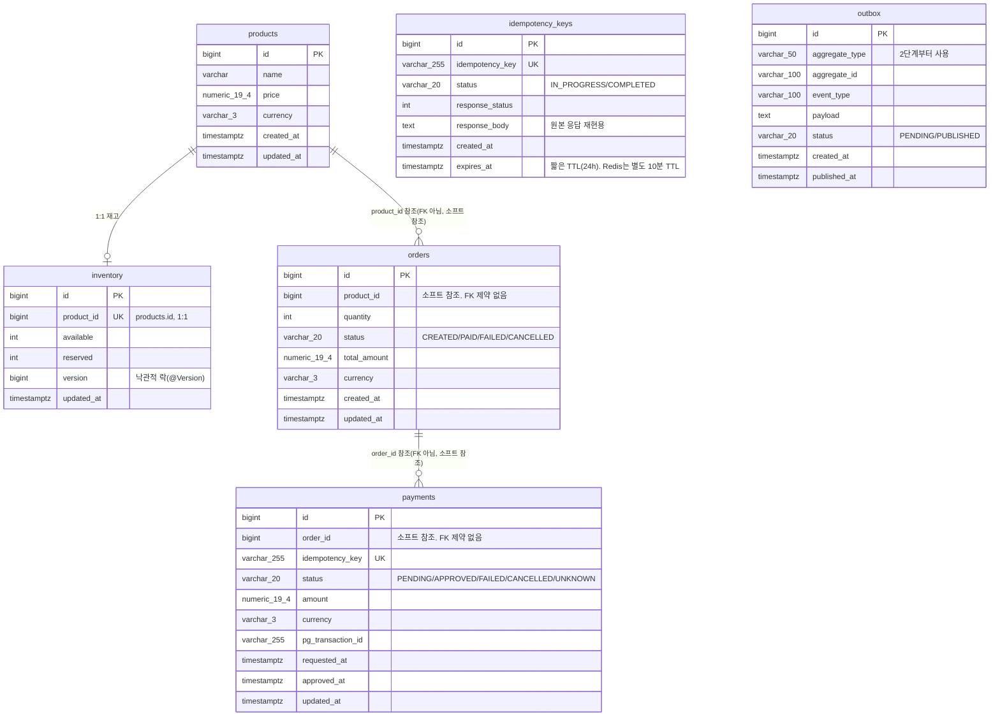

# 1단계 ERD

로드맵 1.1. 1단계(모놀리식)는 단일 DB 스키마를 공유한다. 2단계에서 Order/Payment가
별도 DB로 분리되므로, `orders`/`payments`가 다른 테이블을 JOIN하지 않고 ID만 참조하도록
지금부터 설계한다 (`하위 패키지끼리 직접 의존하지 않는다` 원칙을 스키마 레벨로 반영).

## 설계 메모

- **`orders`/`payments`가 서로 FK를 걸지 않는다.** DB 레벨 FK 제약은 2단계에서 DB가
  분리되는 순간 깨진다. 지금 FK를 걸어두면 2단계 전환 때 "DB 제약이 있었는데 없어졌다"는
  걸 뒤늦게 알아채는 사고가 난다. `order_id`/`product_id`는 애플리케이션 레벨에서만
  참조 무결성을 보장하는 **소프트 참조**로 둔다.
- **`inventory`는 `products`와 1:1.** 상품과 재고를 분리한 이유는, 2단계에서 상품
  카탈로그(가격 등)와 재고 수량의 변경 빈도·소유 서비스가 다를 수 있기 때문. 지금은
  둘 다 `inventory` 패키지가 소유한다(로드맵 1.15 "상품 조회 캐싱"도 이 패키지 담당).
- **`inventory.version`** — 1.11의 낙관적 락(`@Version`) 실험을 위한 컬럼. 비관적 락/
  분산 락 모드에서도 컬럼 자체는 유지하되 검사하지 않는다(락 4종을 스위치로 전환하기
  위해 스키마는 공통으로 둠).
- **`idempotency_keys`는 `payment` 전용이 아니라 `common`에 둔다.** `@Idempotent` AOP가
  어떤 도메인의 어떤 메서드에도 붙을 수 있어야 하므로(CLAUDE.md: "AOP로 분리"), 테이블도
  도메인 중립으로 설계한다. 결제 요청 외의 엔드포인트에 재사용할 가능성을 열어둔다.
  Redis SETNX가 1차 방어(TTL 10분), 이 테이블이 2차 방어(TTL 24시간)다 (부록 A-1).
- **`outbox`는 컬럼만 정의하고 1단계에서는 쓰지 않는다.** 2단계 Transactional Outbox
  패턴(부록 A-3) 도입 시 그대로 쓸 수 있도록 지금 스키마를 확정해둔다.
- **금액은 전부 `numeric(19,4)` + `varchar(3)` 통화 코드.** `double`/`float` 금지
  (CLAUDE.md 코드 규칙, 1.3). Java 측 타입은 `BigDecimal` + `Currency`/문자열.
- **시각은 전부 `timestamptz`(UTC 저장).** 표시할 때만 KST 변환 (CLAUDE.md 코드 규칙).
