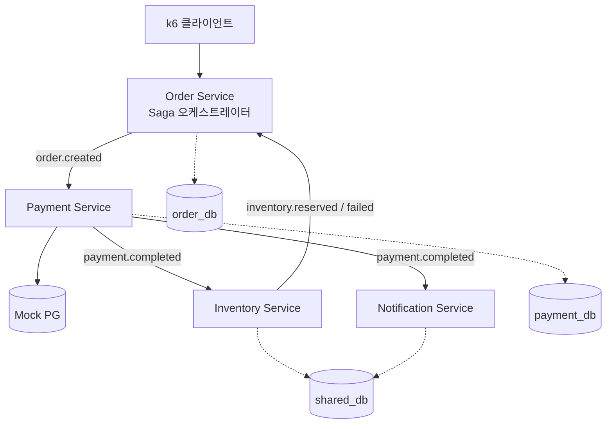

# Payment Lab — 실행 로드맵

README의 5단계 로드맵을 실제로 착수 가능한 태스크 단위로 세분화한 문서입니다.
각 단계는 **목표 → 선행 결정 → 태스크 → 완료 기준(DoD)** 순으로 구성됩니다.

> 이번 개정에서 **R단계(리포지토리 & CI 파이프라인)** 가 추가됐습니다.
> 코드가 쌓이기 전에 게이트를 세워야 하므로 0단계 직후, 1단계 착수 전에 수행합니다.

---

## 진행 원칙

1. **단계마다 "숫자 또는 재현 가능한 증거"를 남긴다.** 기능이 도는 것과 증명하는 것은 다릅니다. 각 단계의 완료 기준은 대부분 측정값이나 테스트로 잡았습니다.
2. **다음 단계를 미리 짓지 않는다.** 단, 2단계에서 서비스를 쪼갤 것이므로 1단계 패키지 구조만은 분리를 염두에 두고 짭니다.
3. **한 번에 한 개념만 켠다.** 락 실험 중에는 캐시를 끄고, 캐시 실험 중에는 락 경합을 없앱니다. 변수를 섞으면 측정값이 의미를 잃습니다.
4. **로컬 리소스는 단계별 프로파일로 관리한다.** 16GB에서 전부 띄우는 건 불가능합니다. (부록 B)
5. **사람이 기억으로 지키는 규칙은 결국 깨진다.** 중요한 규칙은 CI 게이트로 만들어 기계가 지키게 합니다. (R단계)

---

## 단계 개요

| 단계 | 내용 | 아키텍처 / 배포 형태 | CI에서 켜지는 것 |
|---|---|---|---|
| **0** | 기반 세팅 (완료) | 모놀리식 — 프로세스 1개 | — |
| **R** | 리포지토리 + CI 파이프라인 | 모놀리식 — 프로세스 1개 | 빌드/테스트, SAST, SCA, CodeRabbit |
| **1** | 모놀리식 결제 코어 | 모놀리식 — 프로세스 1개 | + 자동 검증 테스트(조용한 실패 탐지) |
| **2** | **MSA 전환** + Kafka Saga | **MSA — 프로세스 4개** | + 서비스별 이미지 매트릭스 빌드 |
| **3** | 장애 방어 + 성능 검증 | MSA — 프로세스 4개 | + (선택) 야간 성능 회귀 잡 |
| **4** | ELK + RAG Agent | MSA + 공통 관측 레이어 | + Secret 스캔 강화 (API 키 유출 방지) |
| **5** | Kubernetes 배포 | MSA — K8s 파드 | + CD 파이프라인 (GHCR 푸시 → 배포) |

> **2단계가 모놀리식 → MSA 전환점입니다.** 1단계까지는 패키지만 나뉜 하나의 애플리케이션이고, 2단계에서 각 패키지가 독립 프로세스가 되면서 트랜잭션 경계가 깨집니다. Saga·Outbox·컨슈머 멱등성이 전부 2단계에 몰려 있는 이유입니다.
>
> Gradle 멀티모듈은 이 전환을 구현하는 **수단**이지 MSA 그 자체가 아닙니다. 멀티모듈로 쪼개놓고도 모듈 간 `implementation(project(":other-service"))` 의존을 걸면 배포가 묶여서 MSA가 되지 않습니다. 2.3 태스크가 이걸 막는 장치입니다.

---

## 0단계 — 기반 세팅

> 상태: **완료.** 상세 기록은 [`troubleshooting/00-spring-boot-4.md`](troubleshooting/00-spring-boot-4.md) 참조.

### 태스크

- [x] **0.1** Gradle 프로젝트 생성 (Java 21, Spring Boot 4.1.1) — 단일 모듈로 시작하되 패키지를 `order` / `payment` / `inventory` / `notification` / `common` 으로 분리. 2단계에서 이 경계가 그대로 서비스 경계가 됨
- [x] **0.2** `docker-compose.base.yml` — PostgreSQL, Redis
- [x] **0.3** Flyway 도입 (`spring-boot-starter-flyway`)
- [x] **0.4** Testcontainers 세팅
- [x] **0.5** 구조화 로깅 — Boot 내장 ECS 포맷, 콘솔은 사람용 / 파일은 기계용
- [x] **0.6** 의존성 호환성 확인 — Boot 4 스타터 매핑, Spring AI 2.0 필요 확인

### 0단계에서 확인된 것 (R단계 설계에 직접 반영)

Boot 4는 **조용한 실패**가 많습니다. 빌드도 기동도 성공하는데 해당 기능만 동작하지 않습니다.

| 조용한 실패 | 영향 받는 로드맵 항목 |
|---|---|
| Flyway 마이그레이션 미실행 | 전 단계 (스키마가 없거나 어긋남) |
| AOP 프록시 미동작 | 1.7 `@Idempotent`, `@DistributedLock` |
| Tracing 미동작 | 4.4 traceId 기반 분산 로그 조회 |

**이 세 가지는 사람이 매번 수동 확인할 수 없습니다.** R단계에서 자동 검증 테스트로 만들어 CI에 태우는 것이 R-CI 파이프라인의 첫 번째 존재 이유입니다. (R.CI5)

---

## R단계 — 리포지토리 & CI 파이프라인

> 목표: 코드가 쌓이기 전에 **품질 게이트를 먼저 세운다.** 이후 모든 PR은 이 게이트를 통과해야만 main에 들어간다.

소요: 1~2일. 이 단계를 1단계 뒤로 미루면, 이미 쌓인 코드에서 수십 건의 경고가 쏟아져 게이트를 꺼버리게 됩니다. **먼저 세우고, 위반이 0인 상태에서 시작하세요.**

### 선행 결정 사항

| 결정 항목 | 선택지 | 권장 |
|---|---|---|
| 레포 공개 범위 | public vs private | **public** — CodeRabbit·Code scanning 무료 티어가 대부분 public 전용 (부록 F) |
| 브랜치 전략 | GitFlow vs trunk-based | **trunk-based** — `main` + 짧은 `feat/*`. 1인 프로젝트에 GitFlow는 과함 |
| 보호 방식 | classic branch protection vs Ruleset | **Ruleset** — 신규 방식, 우회 규칙 관리가 명확 |
| 커밋 컨벤션 | 자유 vs Conventional Commits | **Conventional Commits** — 릴리즈 노트/버전 자동화의 전제 |
| SAST 도구 | Semgrep vs CodeQL | **Semgrep** — 실행이 빠르고 커스텀 룰 작성이 쉬움. CodeQL은 병행 가능 |
| SCA 도구 | Trivy vs Dependabot alerts | **둘 다** — Trivy는 PR 차단용, Dependabot은 자동 PR 생성용 |
| AI 리뷰 | CodeRabbit | **조언형(non-blocking)** — 필수 체크로 걸지 않음 (R.CR4 참조) |

---

### R-A. 리포지토리 생성

- [x] **R.G1** 레포 생성 — 이름 `payment-lab`, public, README/`.gitignore`(Java)/LICENSE(MIT) 포함
- [x] **R.G2** `.gitignore` 보강 — `.env`, `*.local.yml`, `logs/`, `build/`, `.gradle/`, `*.sarif`
  - **0단계에서 만든 `logs/payment-lab.json`이 커밋되지 않게 반드시 확인.** ECS 로그에 결제 페이로드가 들어갑니다.
- [ ] **R.G3** 기존 로컬 프로젝트를 푸시하기 전에 **히스토리에 시크릿이 없는지 확인**
  ```bash
  docker run --rm -v "$PWD:/repo" zricethezav/gitleaks:latest detect --source /repo -v
  ```
  한 번 푸시된 시크릿은 강제 푸시로 지워도 GitHub 캐시에 남습니다. 발견되면 해당 키를 폐기하세요.
- [ ] **R.G4** 브랜치 전략 확정 및 문서화 — `main`(보호) ← `feat/*` / `fix/*` / `chore/*`, 머지는 **Squash merge** 고정
- [x] **R.G5** PR 템플릿 작성 (`.github/pull_request_template.md`) — 부록 D-1
- [x] **R.G6** 이슈 템플릿 — 로드맵 태스크 1개 = 이슈 1개로 운영하면 진행 추적이 쉬움
- [ ] **R.G7** GitHub Projects 보드에 로드맵 태스크 등록 (선택)
- [ ] **R.G8** 레포 설정 — Merge commit/Rebase 비활성, "Automatically delete head branches" 활성

### R-B. 브랜치 보호 (Ruleset)

> **이 단계를 건너뛰면 CI 전체가 장식이 됩니다.** 워크플로가 실패해도 required status check으로 등록하지 않으면 머지 버튼은 그대로 눌립니다.

- [x] **R.G9** Settings → Rules → Rulesets → New branch ruleset, target `main`
- [x] **R.G10** 규칙 활성화
  - Restrict deletions / Block force pushes
  - Require a pull request before merging (approvals는 1인 프로젝트이므로 0)
  - **Require status checks to pass** — 아래 잡 이름을 정확히 등록
    - `build-test`
    - `sast`
    - `sca-dependency`
    - `sca-image`
  - Require branches to be up to date before merging
  - Require linear history
- [x] **R.G11** 본인을 bypass list에 넣을지 결정 — **넣지 마세요.** 급할 때 우회할 수 있으면 게이트는 의미가 없습니다. 정말 막히면 그때 일시적으로 규칙을 끄고, 왜 껐는지 기록하세요.
  - bypass list는 비워둠. 최초 부트스트랩 커밋 1회만 Ruleset을 `Disabled`로 전환 후 즉시 재활성화 (docs/stages/01-repository-ci.md 기록)

> ⚠️ **함정**: 워크플로에 `on.pull_request.paths` 필터를 걸면, 조건에 안 맞는 PR에서 해당 잡이 아예 실행되지 않고 → required check이 영원히 "Expected" 상태로 남아 → **PR이 영구히 머지 불가**가 됩니다.
> 필터는 워크플로 트리거가 아니라 **잡 내부**(`dorny/paths-filter` + `if:`)에서 걸거나, 스킵 시 성공으로 리포트하는 더미 잡을 두세요. 이 프로젝트는 2단계에서 멀티모듈이 되면 반드시 마주칩니다.

### R-C. CI 파이프라인 — PR 게이트

워크플로 전문은 **부록 D-2**. 아래는 각 잡의 목적과 결정 근거입니다.

- [x] **R.CI1** `.github/workflows/pr-check.yml` 생성, `concurrency`로 이전 실행 자동 취소
- [x] **R.CI2** **`build-test` 잡** — Gradle 빌드 + 전체 테스트
  - `gradle/actions/setup-gradle@v4`로 의존성/빌드 캐시
  - Testcontainers는 ubuntu-latest 러너의 Docker를 그대로 사용 (별도 설정 불필요)
  - 테스트 리포트를 `if: always()`로 아티팩트 업로드 — 실패 원인을 로그에서 찾지 않아도 됨
- [x] **R.CI3** **`sast` 잡 — Semgrep**
  - 룰셋: `p/java`, `p/secrets`, `p/owasp-top-ten`
  - 게이트: `--severity ERROR --error` → ERROR 1건이라도 있으면 exit 1
  - SARIF를 `github/codeql-action/upload-sarif@v3`로 업로드 → Security 탭에 누적
  - 컨테이너 이미지 대신 `pip install semgrep` 사용 (SARIF 업로드 액션이 Node를 요구하는데 semgrep 공식 이미지에는 없음)
- [x] **R.CI4** **`sca-dependency` 잡 — Trivy fs**
  - **선행 필수**: Trivy는 Gradle 의존성을 `gradle.lockfile`로만 인식합니다. 락파일이 없으면 Java 의존성 취약점이 **0건으로 조용히 통과**합니다.
    ```kotlin
    // build.gradle.kts
    dependencyLocking { lockAllConfigurations() }
    ```
    ```bash
    ./gradlew dependencies --write-locks   # 락파일 생성 후 커밋
    ```
  - 게이트: `severity: CRITICAL,HIGH` + `ignore-unfixed: true` + `exit-code: 1`
  - `ignore-unfixed`가 중요한 이유는 부록 E-1
- [ ] **R.CI5** **`sca-image` 잡 — Trivy image** (5단계로 의도적 연기 — 아래 참고)
  - 이미지를 빌드해서 로드만 하고(push 안 함) 스캔 → OS 패키지 + 이미지 안의 JAR을 한 번에 커버
  - 2단계부터 서비스별 matrix로 확장
  - **R단계에서는 만들지 않음.** Jib/Dockerfile이 아직 없어 이미지를 빌드할 수 없고,
    지금 붙이면 베이스 이미지 CVE로 게이트가 상시 실패한다(부록 E-1, 5.2 베이스 이미지
    최적화가 선행돼야 함). required status check도 `build-test`/`sast`/`sca-dependency`
    3개만 등록. 5.1~5.2 완료 후 이 잡을 추가하고 Ruleset에도 등록할 것
- [x] **R.CI6** **조용한 실패 자동 검증 테스트** — 0단계 체크리스트를 테스트 코드로 고정
  | 대상 | 테스트 방식 |
  |---|---|
  | Flyway | `@SpringBootTest` + Testcontainers에서 `flyway_schema_history` 행 수 > 0 assert |
  | AOP | 테스트용 `@Aspect` 빈을 띄우고 대상 메서드 호출 → 인터셉트 카운터 증가 assert |
  | Tracing | 테스트 appender로 로그 캡처 → MDC에 `traceId` 존재 assert |

  `build-test` 잡 안에서 함께 돌립니다. **이 3개가 이번 로드맵에서 가장 투자 대비 효과가 큰 테스트입니다.** 1.9의 "중복 결제 100건 → 승인 1건" 테스트가 깨졌을 때, 멱등성 로직 버그인지 AOP 미동작인지를 즉시 구분해줍니다.
  - 구현: `src/test/java/org/example/cs_study/QuietFailureRegressionTest.java` (3개 모두 통과 확인, 로컬 Docker 기준)
- [x] **R.CI7** `.github/dependabot.yml` — gradle / github-actions / docker 주간 업데이트 (부록 D-5)
  - docker 생태계는 Dockerfile/Jib이 생기는 5단계에서 추가 (지금은 감시 대상 없음)
- [x] **R.CI8** 최소 권한 설정 — 워크플로 최상단 `permissions: contents: read`, 필요한 잡에만 `security-events: write` 추가
- [x] **R.CI9** 액션 버전 핀 — 공급망 공격 방어. 태그 대신 커밋 SHA로 핀하고 Dependabot이 갱신하게 함
- [x] **R.CI10** **게이트 검증** — 취약 코드를 일부러 넣고 PR을 올려 실제로 막히는지 확인
  - 계획한 방식(일부러 넣고 되돌리기) 대신, Dependabot PR #1~#8이 Boot 4.1.1 BOM의
    실제 CRITICAL CVE(Tomcat 등)로 `sca-dependency`에 막히는 걸 그대로 관측함 →
    PR #9로 해소. 실전 검증이 계획된 검증을 대신함 (docs/ci-cd.md 실전 검증 기록)
  - SAST: 하드코딩 비밀번호, `Runtime.exec(사용자입력)` 같은 명백한 패턴
  - SCA: `commons-collections:3.2.1` 등 알려진 CRITICAL 의존성을 임시 추가
  - **막히는 걸 눈으로 본 뒤 되돌리세요.** 설정만 해두고 검증 안 하면 동작한다고 착각하게 됩니다.

### R-D. CodeRabbit

CodeRabbit은 **GitHub App**이라 Actions 워크플로가 필요 없습니다. 설치하면 PR 이벤트를 직접 구독합니다. Trivy/Semgrep(규칙 기반)과 역할이 다릅니다.

| 도구 | 잡는 것 | 성격 |
|---|---|---|
| Semgrep | 알려진 취약 **패턴** | 결정적 · 차단 |
| Trivy | 알려진 취약 **버전** | 결정적 · 차단 |
| CodeRabbit | 설계 의도 위반, 로직 결함, 놓친 예외 | 비결정적 · 조언 |

- [x] **R.CR1** CodeRabbit GitHub App 설치, `payment-lab` 레포에 권한 부여 (계정 작업 — 수동)
- [x] **R.CR2** `.coderabbit.yaml` 작성 — 부록 D-4
- [x] **R.CR3** **`path_instructions`에 이 프로젝트의 설계 규칙을 자연어로 등록** — 이게 CodeRabbit을 쓰는 진짜 이유입니다. Semgrep 룰로는 표현하기 어려운 도메인 규칙을 검사하게 만들 수 있습니다.
  - 결제 경로: 금액에 `double`/`float` 금지, 외부 PG 호출이 DB 트랜잭션 안에 들어가지 않을 것
  - Saga 경로: `KafkaTemplate` 직접 호출 금지(Outbox 경유), 보상 트랜잭션의 멱등성
  - 컨슈머 경로: `processed_event` 체크 누락 여부
- [x] **R.CR4** **required status check으로 등록하지 않기.** LLM 리뷰는 비결정적이라 같은 코드에서도 결과가 달라질 수 있습니다. 필수 체크로 걸면 리뷰 코멘트 하나 때문에 머지가 막히고, 결국 앱을 꺼버리게 됩니다. 조언으로 두고 판단은 본인이 하세요.
- [ ] **R.CR5** 리뷰 코멘트 중 **수용한 것만 골라 대응** — "왜 이 지적을 받아들이지 않았는가"를 PR에 한 줄로 남기면 그 자체가 학습 기록이 됩니다
- [ ] **R.CR6** 1~2주 운영 후 `.coderabbit.yaml` 재조정 — 반복되는 노이즈는 `path_filters`로 제외

### 완료 기준 — ✅ 전부 달성 (2026-09-20, 상세: docs/stages/01-repository-ci.md)

- [x] 취약 코드를 넣은 PR이 **실제로 머지 버튼이 잠긴 상태**로 확인됨 (R.CI10 증거 캡처)
  — 계획한 합성 검증 대신 PR #1~#8이 실제 Tomcat CRITICAL CVE로 막혔다가 #9로 해소됨
- [x] Security 탭에 Semgrep/Trivy SARIF 결과가 누적됨
- [x] CodeRabbit이 PR에 자동 리뷰를 남김 (PR #9 확인)
- [x] 정상 PR의 CI 전체 소요 시간 **10분 이내** (실측 약 2분)
- [x] `main` 직접 푸시가 거부됨 (최초 부트스트랩 1회 예외 후 계속 유지)

---

## 1단계 — 모놀리식 결제 코어

> 목표: 결제 도메인의 **정합성 문제**를 단일 애플리케이션 안에서 전부 겪어본다. 분산 문제는 아직 건드리지 않는다.

### 선행 결정 사항

| 결정 항목 | 선택지 | 권장 |
|---|---|---|
| 멱등성 키 전달 방식 | HTTP 헤더 `Idempotency-Key` vs 바디 필드 | 헤더 (Stripe/Toss 관례, AOP로 분리하기 쉬움) |
| 멱등성 저장소 | Redis 단독 vs Redis + DB 유니크 제약 | **2단 방어** (부록 A-1) |
| 멱등 응답 재현 | 원본 응답 저장 vs 409 반환 | 원본 응답 저장 (진짜 멱등의 정의) |
| 재고 차감 방식 | 즉시 차감 vs 예약→확정 | 1단계는 즉시 차감, 2단계에서 예약 모델로 전환 |

### 태스크

**1-A. 도메인 모델링**
- [x] **1.1** ERD 작성 — `orders`, `payments`, `products`, `inventory`, `idempotency_keys`, `outbox`(2단계 대비 컬럼만 정의)
- [x] **1.2** 상태 정의 — 주문 상태(`CREATED / PAID / FAILED / CANCELLED`), 결제 상태(`PENDING / APPROVED / FAILED / CANCELLED`). **상태 전이표를 문서로 먼저 그리고** 코드로 옮깁니다. Saga 상태머신의 기반이 됩니다.
- [x] **1.3** 금액 타입 결정 — `BigDecimal` + 통화 코드, DB는 `numeric(19,4)`. `double` 절대 금지. → CodeRabbit `path_instructions`와 Semgrep 커스텀 룰 양쪽에 등록

**1-B. API 및 Mock PG**
- [x] **1.4** REST API 명세 작성 (OpenAPI) — 주문 생성, 결제 요청, 결제 조회, 결제 취소
- [x] **1.5** Mock PG 서버 구현 — **별도 프로세스로 띄우고** 다음을 런타임에 주입 가능하게 만듭니다:
  - 응답 지연(ms), 실패율(%), 특정 에러코드 강제, 타임아웃 유발
  - 이 Mock의 품질이 3단계 Resilience4j 학습의 품질을 그대로 결정합니다. 대충 만들지 마세요.
- [x] **1.6** Mock PG 자체의 멱등성 — 실제 PG사도 멱등 키를 받습니다. 재시도 시 이중 승인이 안 나는 걸 확인하려면 Mock도 멱등해야 합니다.

**1-C. 멱등성**
- [x] **1.7** `@Idempotent` 어노테이션 + AOP Aspect 구현 (R.CI6의 AOP 검증 테스트가 먼저 통과한 상태여야 함)
- [x] **1.8** 3-상태 처리: `없음(진행)` / `IN_PROGRESS(409 또는 대기)` / `COMPLETED(저장된 응답 반환)`
- [x] **1.9** 동시 중복 요청 테스트 — 같은 키로 100개 동시 요청 → 승인 1건만, 나머지는 동일 응답
- [x] **1.10** Redis 다운 시나리오 테스트 — Redis를 내린 상태에서 중복 요청 → DB 유니크 제약이 막아주는지 확인

**1-D. 동시성 제어 (이 단계의 핵심)**
- [x] **1.11** 재고 차감을 **4가지 방식으로 각각 구현**하고 스위치로 전환 가능하게:
  1. 락 없음 (문제 재현용 — Lost Update가 실제로 나는 걸 눈으로 봐야 합니다)
  2. 비관적 락 (`SELECT ... FOR UPDATE`)
  3. 낙관적 락 (`@Version` + 재시도)
  4. Redisson 분산 락 (`RLock`)
- [x] **1.12** 동시성 테스트 — 재고 100개에 동시 요청 300건 → 정확히 100건 성공, 재고 0
- [x] **1.13** 4가지 방식의 **TPS / p95 / 실패율 / 데드락 발생 여부** 측정표 작성
- [x] **1.14** 낙관적 락 재시도 횟수를 1/3/5/10으로 바꿔가며 경합률에 따른 성능 곡선 확인

**1-E. 캐싱**
- [x] **1.15** 상품 조회 Look-aside 캐싱 (`@Cacheable`), TTL 및 키 전략 결정
- [x] **1.16** 캐시 무효화 — 재고 변경 시 캐시를 어떻게 다룰지. **재고처럼 자주 바뀌는 값은 캐싱 대상이 아니라는 결론이 나올 수도 있습니다.** 그 판단 과정 자체를 기록해두세요.
- [x] **1.17** Cache Stampede 재현 — TTL 만료 순간 동시 요청 폭주 시 DB 부하. 방어책(분산 락 또는 논리적 만료) 적용 전/후 비교.

**1-F. 관측 및 측정**
- [x] **1.18** Actuator + Micrometer + Prometheus + Grafana 구성
- [x] **1.19** 커스텀 메트릭 — 결제 성공/실패 카운터, 멱등 히트율, 락 대기 시간
- [x] **1.20** k6 기본 시나리오 작성 (주문→결제 플로우)
- [x] **1.21** **베이스라인 측정 및 기록** — 이후 모든 개선은 이 숫자와 비교됩니다
- [x] **1.22** CI 실행 시간 점검 — 동시성 테스트가 붙으면서 `build-test` 잡이 길어집니다. 10분을 넘기면 부록 E-3의 분리 전략 적용

### 완료 기준
- 중복 결제 요청 100건 → 승인 1건, 나머지 동일 응답 반환 (테스트 자동화)
- 재고 초과 판매 0건 (동시성 테스트 통과)
- 락 4종 성능 비교표가 `benchmarks/01-lock-strategies.md`에 숫자로 존재
- Grafana에서 TPS와 p95를 실시간으로 볼 수 있음
- 위 테스트가 전부 **CI에서** 통과 (로컬에서만 통과는 인정하지 않음)

---

## 2단계 — 서비스 분리 + Kafka Saga

> 목표: 하나의 트랜잭션으로 묶여 있던 흐름을 4개 서비스로 쪼개고, **트랜잭션 경계가 사라졌을 때 생기는 문제들**을 전부 겪는다.

이 단계가 프로젝트 전체에서 가장 무겁고 가장 배울 게 많습니다. 시간을 넉넉히 잡으세요.

### 선행 결정 사항

| 결정 항목 | 권장 |
|---|---|
| Saga 방식 | 오케스트레이션 (README대로). Order Service가 조율자 |
| Saga 상태 저장 | `saga_instance` + `saga_step` 테이블 (부록 A-2) |
| 이벤트 발행 원자성 | **Transactional Outbox 패턴 필수** (부록 A-3) |
| 파티션 키 | `orderId` — 같은 주문의 이벤트는 순서 보장 |
| 직렬화 | JSON + 명시적 `eventType`/`version` 필드. Avro는 학습 부담이 커서 후순위 |
| 재고 모델 | **예약 → 확정/해제 2단계로 전환** (부록 A-4) |
| CI 빌드 범위 | 변경된 모듈만 빌드/스캔 (paths-filter는 잡 내부에서) |

> **Jackson 3 주의** — Boot 4는 Jackson 3이고 프로퍼티가 기본 알파벳 순 정렬입니다. 이벤트 봉투의 필드 순서가 중요하다면 `@JsonPropertyOrder`를 명시하고, `JacksonException`이 `RuntimeException`이 된 점도 직렬화 실패 처리에 반영하세요.

### 태스크

**2-A. 분리 준비**
- [x] **2.1** Gradle 멀티모듈로 전환, `common-event` 모듈에 이벤트 계약(DTO) 정의
- [x] **2.2** DB 분리 — Order / Payment는 별도 스키마 또는 별도 인스턴스, Inventory / Notification은 공유 (README 방침)
- [x] **2.3** 서비스 간 **동기 호출을 전부 제거**했는지 확인. 남아 있으면 Saga가 의미 없어집니다.
- [x] **2.4** **CI를 멀티모듈로 전환** — `sca-image` 잡에 matrix 도입, `dorny/paths-filter`로 변경 모듈 감지
  - ⚠️ 워크플로 레벨 `paths:` 필터는 쓰지 말 것 (R.G10의 함정)
  - 서비스 4개 이미지를 매번 빌드하면 PR 시간이 4배가 됩니다. 변경분만 빌드하되, required check은 항상 리포트되게 구성

**2-B. Kafka 기반**
- [x] **2.5** Kafka(KRaft 모드, 단일 브로커) docker-compose 추가
- [x] **2.6** 토픽 설계 문서 — 토픽명, 파티션 수, 보존 기간, 키, 페이로드 스키마
  - `order.created`, `payment.requested`, `payment.completed`, `payment.failed`, `inventory.reserved`, `inventory.failed`, `order.cancelled`, `notification.requested`
- [x] **2.7** 이벤트 공통 봉투(envelope) 정의 — `eventId`, `eventType`, `version`, `occurredAt`, `traceId`, `payload`
  - MDC는 ThreadLocal이라 Kafka 컨슈머 스레드에서 끊깁니다. `traceId`를 봉투에 실어 나르고, 컨슈머에서 MDC에 복원하세요.
- [x] **2.8** Transactional Outbox 구현 — 비즈니스 DB 커밋과 동일 트랜잭션에 outbox insert, 별도 릴레이가 폴링해서 Kafka 발행
- [x] **2.9** 컨슈머 멱등성 — `processed_event(event_id)` 테이블로 중복 소비 차단. **Kafka는 at-least-once이므로 중복은 반드시 옵니다.**
- [x] **2.10** **Semgrep 커스텀 룰 작성** — `KafkaTemplate.send()` 직접 호출 금지 (Outbox 우회 방지). 부록 D-3
  - 이 규칙은 리뷰어가 매번 눈으로 잡을 수 없습니다. 기계가 막아야 합니다.

**2-C. Saga 오케스트레이션**
- [x] **2.11** `saga_instance` 테이블 + 상태 전이 로직 구현
- [x] **2.12** 정상 흐름 완성: 주문 생성 → 결제 → 재고 예약 → 재고 확정 → 알림 → Saga 완료
- [x] **2.13** 보상 트랜잭션 구현
  - 재고 예약 실패 → 결제 취소 → 주문 취소
  - 알림 실패 → 보상하지 않음 (재시도 대상). **어디까지 보상하고 어디부터 재시도인지 경계를 정하는 게 핵심입니다.**
- [x] **2.14** 보상 자체의 멱등성 — 취소 이벤트가 두 번 와도 이중 환불이 나면 안 됩니다
- [x] **2.15** 타임아웃 처리 — 스케줄러가 일정 시간 이상 특정 단계에 머문 Saga를 찾아 보상 개시
- [x] **2.16** DLQ 구성 + 재처리 방법 문서화

**2-D. 검증**
- [x] **2.17** 장애 주입 테스트 — 각 서비스를 하나씩 죽인 상태로 주문 → 복구 후 Saga가 이어지거나 보상되는지
- [x] **2.18** 중복 이벤트 강제 주입 테스트
- [x] **2.19** Testcontainers 기반 Saga 통합 테스트 (정상 1건 + 보상 시나리오 3건)
  - Kafka 컨테이너가 붙으면서 CI 시간이 크게 늡니다. 부록 E-3 참조
- [x] **2.20** 1단계 대비 성능 비교 — **분리 후 latency는 거의 확실히 나빠집니다.** 그 트레이드오프를 숫자로 남기는 게 이 태스크의 목적입니다.

### 완료 기준
- Payment Service를 강제 종료한 상태로 주문 100건 → 재기동 후 전부 완료 또는 전부 보상 (유실 0, 이중 처리 0)
- 재고 초과 판매 0건 (분산 환경에서도)
- Saga 상태 조회 API로 임의 주문의 진행 단계를 추적 가능
- `KafkaTemplate` 직접 호출 PR이 Semgrep에 의해 차단됨 (검증 완료)

---

## 3단계 — 장애 방어 + 성능 검증

> 목표: 외부 의존성이 죽어도 내 서비스는 살아 있게 만들고, 그걸 숫자로 증명한다.

### 태스크

**3-A. Resilience4j**
- [x] **3.1** 데코레이터 **적용 순서 결정** — Retry → CircuitBreaker → TimeLimiter 순서에 따라 동작이 완전히 달라집니다. 순서를 바꿔가며 실험하고 결과를 기록하세요. (기본 순서: Retry가 가장 바깥)
- [x] **3.2** CircuitBreaker 튜닝 — `slidingWindowSize`, `failureRateThreshold`, `waitDurationInOpenState`, `permittedNumberOfCallsInHalfOpenState`
- [x] **3.3** Retry — 지수 백오프 + Jitter. **재시도가 안전한 요청인지(멱등한지) 먼저 확인**하고 적용
- [x] **3.4** TimeLimiter — PG 응답 타임아웃. 타임아웃된 결제의 상태는 `UNKNOWN`이지 `FAILED`가 아닙니다. 이 구분이 실무에서 가장 자주 사고 나는 지점입니다.
- [x] **3.5** Bulkhead — PG 호출 스레드풀 격리
- [x] **3.6** Fallback 설계 — 서킷 OPEN일 때 결제를 어떻게 처리할지. 즉시 실패 vs 큐잉 후 지연 처리. Saga 타임아웃 로직과 연계되어야 합니다.
  - `register-health-indicator: false`는 0단계에서 이미 설정됨. 서킷 OPEN이 `/actuator/health`를 DOWN으로 만들면 5단계 readiness probe에서 **외부 장애 때 내 파드가 빠집니다.**

**3-B. 장애 시나리오**
- [x] **3.7** Mock PG 장애 시나리오 스크립트 — 점진적 지연 증가 / 간헐적 실패 / 완전 다운 / 느린 복구
  - `scripts/fault-scenario-mockpg.sh` (PR #91). 로컬에서 `gradual-latency` 시나리오 실행 검증 완료 — delayMs 0→5000 전 구간에서 order-service `POST /api/orders`가 전부 201, 정상 구간 복귀 및 cleanup까지 에러 없이 완료.
- [x] **3.8** 각 시나리오에서 서킷 상태 전이(CLOSED→OPEN→HALF_OPEN→CLOSED)를 Grafana에서 관찰하고 캡처
  - `complete-down` 시나리오로 로컬에서 CLOSED→OPEN→HALF_OPEN→CLOSED 풀 사이클 캡처 완료. 상세 기록: `docs/troubleshooting/07-resilience.md` 7절.
- [x] **3.9** **방어 로직 없는 버전과 비교** — PG가 5초 지연될 때 방어 없으면 커넥션 풀이 고갈되어 전체가 멈추는 걸 재현. 이게 3단계의 하이라이트입니다.
  - 임시 로컬 브랜치(병합 안 함)에서 재현. 커넥션 풀이 아니라 Kafka 리스너 스레드(concurrency=1)가 고갈됨 — 주문 10건이 완전 직렬화되어 평균 9.37초/건, 총 93.7초 소요(정상 시 0.05~1.1초). 상세: `docs/troubleshooting/07-resilience.md` 8절.

**3-C. 성능 측정**
- [x] **3.10** k6 시나리오 4종 — smoke / load / stress / spike
  - `k6/saga-order-flow.js`의 `PROFILE` 환경변수로 전환. 로컬에서 4개 전부 실행 검증 완료 — smoke(VU 1)는 정상(Saga 완료 평균 10.46초), load(VU 20)부터 주문 생성 API 자체가 평균 6.74초로 느려지고 Saga 완료가 POLL_TIMEOUT_MS(15초) 안에 못 끝남. 로컬 1대에 4서비스+Kafka+Postgres 3개+Redis를 다 띄운 환경의 자원 한계로 보이며, 원인 분석은 3.12(벤치마크 리포트)로 넘김.
- [x] **3.11** 측정 자동화 — 스크립트 한 번으로 결과가 파일로 떨어지게
  - `scripts/measure-load-profiles.sh` (PR #95). 로컬에서 전체 실행 검증 완료 — `benchmarks/raw/`에 `smoke.json`, `load-run{1,2,3}.json`, `stress.json`, `stress-points.json`, `spike.json`, `spike-points.json` 7개 전부 생성 확인.
- [x] **3.12** **종합 벤치마크 리포트 작성**
  - 락 전략별 (1단계 재측정) / 캐시 유무별 / 모놀리식 vs MSA / 서킷 유무별
  - 각각 TPS / p50 / p95 / p99 / 에러율
  - `benchmarks/01-lock-strategies.md` ~ `06-cache.md` 실측 완료 + `benchmarks/07-summary.md`로 4축 종합(PR #97). p99는 모놀리식 vs MSA/서킷 유무 두 축에서 원본 미수집이라 사후 추정 없이 "미측정"으로 명시. 로컬 측정 환경(인텔리제이+Docker Desktop/WSL2 동시 구동) 노이즈로 p95/p99 절대값 신뢰 구간이 넓다는 점을 교차 축 공통 한계로 기록.
- [ ] **3.13** Grafana 대시보드 정리 — 서킷 상태, PG 응답시간, Saga 단계별 소요시간
- [ ] **3.14** **(선택) 야간 성능 회귀 워크플로** — `schedule` 트리거로 k6 smoke를 돌려 p95가 기준치를 넘으면 이슈 자동 생성
  - PR마다 돌리기엔 무겁고 러너 성능 편차가 커서 노이즈가 큽니다. 절대값 비교는 로컬에서, CI는 "급격한 악화 감지" 용도로만 쓰세요.

### 완료 기준
- PG 완전 다운 상태에서도 주문 API가 3초 안에 응답 (전체 장애 전파 없음)
- 벤치마크 리포트가 표와 그래프로 정리되어 있음
- 서킷 상태 전이가 대시보드에 시각화됨

---

## 4단계 — ELK + RAG Agent

> 목표: 로그를 검색 가능한 자산으로 만들고, 그 위에 LLM을 얹어 운영 지원 기능을 만든다.

**"데이터 확보 → 검색 → RAG"** 순서를 지키세요. 데이터 없이 RAG부터 만들면 검증할 수가 없습니다.

> **0단계에서 확정된 제약 2가지**
> 1. **Spring AI 2.0 이상 필요.** 1.0/1.1은 Boot 3.4/3.5 대상이고 Boot 4에서 기동 자체가 실패합니다(설정으로 우회 불가). 인터넷의 1.0 기준 RAG 예제가 그대로 안 붙으니 공식 레퍼런스를 먼저 보세요.
> 2. **Anthropic API에는 임베딩 엔드포인트가 없습니다.** 채팅 모델만 제공합니다. RAG에는 EmbeddingModel과 ChatModel 두 개가 필요하며, `spring-ai-starter-model-transformers`(로컬 ONNX)를 쓰면 추가 API 키 없이 해결됩니다.

### 태스크

**4-A. 로그 파이프라인**
- [ ] **4.1** ES 단일 노드 + Kibana 구성 (힙 1~2GB로 제한)
- [ ] **4.2** 인덱스 설계 — **로그용과 벡터용 인덱스를 명확히 분리**
  - `payment-logs-*` : 원본 로그(ECS 포맷), ILM으로 보존기간 관리
  - `payment-incidents` : 이상거래/실패 사례 문서 (구조화)
  - `payment-knowledge` : 벡터 임베딩 저장 (`dense_vector`)
- [ ] **4.3** 적재 방식 — Filebeat 경유. 0단계에서 ECS JSON 파일 출력을 이미 켜뒀으므로 그대로 맞물립니다.
- [ ] **4.4** `traceId` 기반으로 하나의 주문이 4개 서비스를 지나간 로그를 한 번에 조회 가능한지 확인
  - R.CI6의 Tracing 검증 테스트가 통과 상태여야 성립합니다
- [ ] **4.5** Kibana 대시보드 — 실패 사유별 분포, 시간대별 실패율, PG 응답시간 분포

**4-B. 이상거래 데이터 생성**
- [ ] **4.6** 이상거래 판정 룰 정의 — 짧은 시간 내 반복 결제, 비정상 금액, 동일 카드 다중 주문 등 (룰 기반이면 충분. ML까지 갈 필요 없음)
- [ ] **4.7** 판정된 건을 `payment-incidents`에 구조화 문서로 적재
- [ ] **4.8** **데이터 생성 스크립트** — k6로 이상 패턴을 의도적으로 발생시켜 사례를 수백 건 축적

**4-C. RAG**
- [ ] **4.9** Spring AI 2.0 + Anthropic(Chat) + transformers(Embedding) 연동, ES를 VectorStore로 설정
- [ ] **4.10** 임베딩 파이프라인 — incident 문서 1건 = 1청크가 자연스럽습니다
- [ ] **4.11** 검색 전략 — 벡터 단독 vs 하이브리드(BM25 + 벡터). **결제 실패코드처럼 정확 매칭이 중요한 필드가 있으므로 하이브리드가 유리.** 둘 다 구현해서 비교
- [ ] **4.12** 메타데이터 필터링 — 기간, 실패 유형으로 사전 필터 후 벡터 검색
- [ ] **4.13** 프롬프트 설계 — **반드시 근거 문서 ID를 함께 반환**하게 만들어 환각을 검증 가능하게
- [ ] **4.14** API 구현 — `POST /ai/analyze`

**4-D. 보안 (이 단계에서 새로 생기는 리스크)**
- [ ] **4.15** **API 키 관리** — `ANTHROPIC_API_KEY`는 GitHub Secrets, 로컬은 `.env`(gitignore 확인)
- [ ] **4.16** Secret 스캔 강화 — Trivy `--scanners secret`와 Semgrep `p/secrets`가 이미 돌고 있지만, 4단계는 **키가 실제로 존재하는 첫 단계**입니다. R.G3의 gitleaks 스캔을 한 번 더 돌리세요.
- [ ] **4.17** 로그에 프롬프트/응답 원문을 남기지 않기 — ES에 그대로 적재되면 결제 데이터가 LLM 컨텍스트와 함께 평문으로 쌓입니다
- [ ] **4.18** 비용 상한 — 토큰 사용량 메트릭 + 호출 횟수 제한

**4-E. Agent (선택)**
- [ ] **4.19** Tool 정의 — 결제 상태 조회, 로그 검색, Saga 상태 조회
- [ ] **4.20** LLM이 툴을 골라 호출하는 흐름 구현
- [ ] **4.21** 툴 호출 횟수/토큰 사용량 제한 및 메트릭 수집

**4-F. 평가**
- [ ] **4.22** 골든셋 — 질문 20개와 기대 답변/근거 문서를 손으로 작성
- [ ] **4.23** 검색 품질 측정 — 기대 문서가 상위 K개에 들어오는 비율
- [ ] **4.24** 비용 추적 — 호출당 토큰/비용을 메트릭으로

### 완료 기준
- 임의의 실패 결제 ID로 질의 → 유사 과거 사례 3건과 함께 원인 분석 응답
- 답변에 인용된 문서 ID가 실제 incident와 일치 (환각 검증 통과)
- 골든셋 20문항 중 검색 정확도 기록
- 레포 전체 secret 스캔 0건

---

## 5단계 — Kubernetes 배포 + CD

> 목표: docker-compose로 돌던 것이 오케스트레이션 환경에서는 왜 안 도는지를 겪고, 배포를 자동화한다.

### 선행 결정 사항

| 결정 항목 | 선택지 | 권장 |
|---|---|---|
| 이미지 레지스트리 | GHCR vs Docker Hub | **GHCR** — GITHUB_TOKEN으로 인증 끝, public 무료 |
| 이미지 태그 | `latest` vs commit SHA | **SHA 고정** (`sha-a1b2c3d`) + 부가로 `latest`. `latest`만 쓰면 어떤 커밋이 떠 있는지 알 수 없음 |
| 배포 방식 | push형(러너→클러스터) vs pull형(GitOps) | **로컬 클러스터는 push 불가** → 부록 E-4 |
| 매니페스트 관리 | 생 YAML vs Kustomize | **Kustomize** — 이미지 태그 자동 치환이 한 줄 |

### 태스크

**5-A. 이미지**
- [ ] **5.1** 이미지 빌드 — Jib 또는 멀티스테이지 Dockerfile, JVM 컨테이너 옵션 (`-XX:MaxRAMPercentage=75`)
- [ ] **5.2** **베이스 이미지 선택이 Trivy 결과를 좌우합니다.** `eclipse-temurin:21-jre` 계열은 OS 패키지 CVE가 수십 건씩 잡혀 게이트가 상시 빨간불이 됩니다. distroless 또는 Chainguard 계열로 바꾸면 대부분 사라집니다. (부록 E-1)
- [ ] **5.3** 이미지 크기 최적화, 레이어 캐싱 (`docker/build-push-action`의 `cache-from: type=gha`)

**5-B. 클러스터 및 매니페스트**
- [ ] **5.4** kind 또는 k3d 클러스터 생성 (노드 1~2개)
- [ ] **5.5** 미들웨어 배치 결정 — **PG/Redis/Kafka/ES를 클러스터 안에 넣으면 16GB로는 거의 확실히 터집니다.** 미들웨어는 호스트 docker-compose, 앱만 K8s에 올리는 하이브리드 권장
- [ ] **5.6** Deployment / Service / ConfigMap / Secret 작성, `kustomization.yaml` 구성
- [ ] **5.7** `resources.requests/limits` 설정 — 안 넣으면 스케줄링 사고를 겪게 됩니다
- [ ] **5.8** Ingress 또는 NodePort로 외부 접근

**5-C. 운영 관심사**
- [ ] **5.9** Probe 3종 — liveness / readiness / startup. **Actuator health group을 분리**해서 readiness에는 Kafka/DB 의존성을 포함
  - Boot 4는 K8s probe가 기본 활성이라 `/actuator/health/liveness`, `/readiness`가 바로 있습니다
  - **startup probe 시간 산정 근거**: 0단계 측정 기준선 17~22초(로컬 Windows). 컨테이너 안에서 재측정 후 여유 2배로 잡으세요
- [ ] **5.10** Graceful shutdown — `SIGTERM` 수신 후 진행 중인 Kafka 컨슘과 HTTP 요청을 마치고 종료. `terminationGracePeriodSeconds`와 Spring `shutdown.grace-period`를 맞춥니다
- [ ] **5.11** **무중단 배포 검증** — k6를 돌리는 상태에서 롤링 업데이트 → 에러율 0인지 확인. 실패하면 5.9/5.10이 잘못된 겁니다
- [ ] **5.12** HPA 실험 — 늘어난 파드가 분산 락/멱등성을 제대로 지키는지 재검증 (1~2단계 로직의 진짜 시험대)
- [ ] **5.13** ConfigMap 변경 시 재시작 전략, Secret 관리 방식 정리

**5-D. CD 파이프라인**

워크플로 전문은 **부록 D-6**.

- [ ] **5.14** `.github/workflows/release.yml` — `push: branches: [main]` 트리거
- [ ] **5.15** 이미지 빌드 → **Trivy 스캔 → 통과 시에만 GHCR push** 순서로 구성
  - 순서가 중요합니다. push 후 스캔하면 취약한 이미지가 이미 레지스트리에 올라간 뒤입니다
- [ ] **5.16** `permissions: packages: write` 부여, `docker/login-action`으로 GHCR 로그인
- [ ] **5.17** 태그 전략 구현 — `sha-<short>`, `latest`, (선택) 태그 푸시 시 semver
- [ ] **5.18** **매니페스트 이미지 태그 자동 갱신**
  ```bash
  kustomize edit set image payment-lab/order=ghcr.io/<user>/order:sha-${GITHUB_SHA::7}
  ```
  커밋 후 푸시. `GITHUB_TOKEN`으로 푸시하면 워크플로가 재트리거되지 않으므로 무한 루프는 생기지 않습니다 (PAT를 쓰면 루프에 빠집니다)
- [ ] **5.19** **배포 실행 방식 선택** — 부록 E-4에서 하나 고르기
  - A: 수동 (`kubectl apply`) — 가장 단순, 여기서 시작
  - B: self-hosted runner를 로컬에 설치 — 러너가 클러스터에 접근 가능
  - C: **ArgoCD GitOps** — 로컬 Argo가 레포를 폴링. 학습 가치가 가장 높음
- [ ] **5.20** GitHub Environments 설정 — `prod` 환경에 required reviewer를 걸어 수동 승인 게이트 체험
- [ ] **5.21** 롤백 절차 문서화 및 실제 수행
  - push형: `kubectl rollout undo deployment/order-service`
  - GitOps: 매니페스트 커밋 revert → Argo가 자동 되돌림
  - **한 번은 실제로 롤백해보세요.** 문서만 있고 안 해본 롤백은 장애 때 작동하지 않습니다
- [ ] **5.22** 배포 이력 확인 — 어떤 커밋이 언제 어떤 이미지로 떴는지 추적 가능한지

### 완료 기준
- 롤링 업데이트 중 k6 에러율 0%
- Payment Service 3 레플리카 상태에서 중복 결제 0건
- `main` 머지 → 이미지 자동 빌드·스캔·푸시까지 사람 개입 0
- 롤백 1회 실제 수행 및 소요 시간 기록
- 매니페스트만으로 클러스터 재구축 가능

---

# 부록 A — 주요 설계 결정 상세

## A-1. 멱등성 2단 방어

Redis 단독은 Redis 장애 시 그대로 뚫립니다. 반대로 DB 유니크 제약만 쓰면 매 요청이 DB를 때립니다.

```
1) Redis SETNX(key, IN_PROGRESS, TTL)
   → 실패: 이미 처리 중이거나 완료됨 → 저장된 응답 조회 후 반환
   → 성공: 계속 진행
2) DB에 idempotency_keys INSERT (unique 제약)
   → 제약 위반: Redis가 놓친 중복 → 기존 결과 반환
3) 비즈니스 로직 수행
4) 응답을 DB와 Redis에 저장, 상태를 COMPLETED로
```

TTL이 만료된 뒤 같은 키가 다시 오면? **DB 레코드는 더 오래 남겨두고(예: 24시간) Redis는 짧게(예: 10분) 가져가세요.** Redis는 빠른 차단용, DB는 최종 진실입니다.

## A-2. Saga 상태 테이블

```
saga_instance
  saga_id (PK)
  order_id
  status          -- STARTED / COMPENSATING / COMPLETED / FAILED
  current_step    -- PAYMENT / INVENTORY / NOTIFICATION
  created_at, updated_at, timeout_at

saga_step
  id (PK)
  saga_id (FK)
  step_name
  status          -- PENDING / SUCCESS / FAILED / COMPENSATED
  request_payload, response_payload
  attempted_at
```

`timeout_at`을 두면 스케줄러가 `WHERE status='STARTED' AND timeout_at < now()`로 지연된 Saga를 회수할 수 있습니다. 이게 없으면 이벤트가 유실됐을 때 주문이 영원히 STARTED에 머뭅니다.

## A-3. Transactional Outbox가 필요한 이유

```java
@Transactional
public void createOrder(...) {
    orderRepository.save(order);   // DB 커밋됨
    kafkaTemplate.send(event);     // 여기서 앱이 죽으면?
}
```

주문은 생겼는데 이벤트는 안 나갑니다. 반대 순서로 하면 이벤트는 나갔는데 주문이 없습니다. **DB 트랜잭션과 Kafka 발행은 원자적으로 묶이지 않습니다.**

해결: 같은 트랜잭션 안에서 `outbox` 테이블에 이벤트를 INSERT하고, 별도 릴레이(폴링 스케줄러 또는 Debezium CDC)가 outbox를 읽어 Kafka로 발행 후 발행 완료 표시. 학습 목적이면 폴링 방식으로 충분합니다.

> 이 규칙은 **2.10의 Semgrep 커스텀 룰로 강제**합니다. 사람이 매번 기억해서 지키는 규칙은 결국 깨집니다.

## A-4. 재고 예약 모델

즉시 차감 방식은 보상이 불가능한 경우가 생깁니다.

> 주문 A가 마지막 재고 1개를 차감 → 알림 단계 실패 → 보상으로 재고 복구 시도
> 그런데 그 사이 주문 B가 복구된 재고를 가져갔다면? 복구 자체는 되지만 A의 고객은 이미 결제 취소됨

그래서 재고를 `available` / `reserved` 두 컬럼으로 관리합니다.

```
예약: available -= n, reserved += n   (Saga 진행 중)
확정: reserved -= n                   (Saga 성공)
해제: reserved -= n, available += n   (Saga 실패 → 보상)
```

예약에는 만료 시간을 두어, Saga가 죽어도 스케줄러가 예약을 회수하게 만듭니다.

---

# 부록 B — 단계별 로컬 리소스 프로파일

16GB RAM 기준. 전부 동시에 띄우는 구성은 없습니다.

| 프로파일 | 구성 | 예상 사용량 |
|---|---|---|
| `base` (1단계) | PostgreSQL, Redis, Prometheus, Grafana, 앱 1개, Mock PG 1개 | ~5GB |
| `saga` (2단계) | + Kafka(KRaft 단일), PG 2인스턴스, 앱 4개 | ~9GB |
| `perf` (3단계) | saga + k6 (Prometheus/Grafana는 1단계부터 이미 켜져 있음) | ~11GB |
| `elk` (4단계) | base + Kafka + ES(힙 2GB) + Kibana + 앱 4개<br>**Prometheus/Grafana는 내림** | ~12GB |
| `k8s` (5단계) | 호스트에 미들웨어, k3d에 앱만<br>**ES/Kibana는 내림** | ~12GB |

> 1.18에서 Prometheus/Grafana를 1단계로 앞당겼습니다. 원래 이 표는 `perf`(3단계)부터
> 관측 스택을 켜는 것으로 그려져 있었지만, 1단계 완료 기준 자체가 "Grafana에서 TPS/p95를
> 실시간으로 볼 수 있음"이라 관측 스택 없이는 1단계를 끝낼 수 없습니다. 메모리 여유가
> 없다면 측정할 때만 `docker-compose.observability.yml`을 올렸다 내리세요.

compose 파일을 프로파일별로 쪼개고(`docker-compose.base.yml`, `.kafka.yml`, `.observability.yml`, `.elk.yml`) `-f` 조합으로 켜고 끄세요.

**메모리 절약 팁**
- ES: `ES_JAVA_OPTS=-Xms1g -Xmx1g`, `discovery.type=single-node`
- Kafka: KRaft 모드로 Zookeeper 제거, 힙 512MB
- 앱: `-Xmx512m` (부하 테스트 때는 예외)
- Kibana는 필요할 때만 기동
- ES/Spring AI 의존성은 4단계 전까지 주석 처리 (기동 35초 → 17초)

---

# 부록 C — 리스크

| 리스크 | 상태 | 대응 |
|---|---|---|
| Boot 4 조용한 실패 | **확인됨** (Flyway/AOP/Tracing) | R.CI6 자동 검증 테스트로 고정 |
| Spring AI 1.x Boot 4 비호환 | **확인됨** (기동 실패, 우회 불가) | 4단계에서 Spring AI 2.0 사용 |
| Anthropic 임베딩 모델 부재 | **확인됨** | `spring-ai-starter-model-transformers` 병행 |
| Trivy 게이트 상시 실패로 무력화 | 예상 | 베이스 이미지 교체(5.2) + `ignore-unfixed` + 만료일 있는 `.trivyignore` (E-1) |
| CI 시간이 길어져 PR이 느려짐 | 예상 | 캐시 → 잡 분리 → 무거운 테스트는 nightly로 (E-3) |
| required check 미등록으로 게이트 무력 | 예상 | R.CI10에서 실제 차단을 눈으로 확인 |
| paths 필터로 PR 영구 블로킹 | 예상 | 워크플로 레벨 `paths:` 금지, 잡 내부 필터링 (R.G10) |
| 2단계 분량 과다 | 예상 | 2-B(Kafka 기반)까지를 별도 마일스톤으로 끊고 중간 점검 |
| 4단계 RAG가 "데모"에 그침 | 예상 | 4-F 평가 태스크 필수 수행 |
| 5단계 리소스 부족 | 예상 | 미들웨어를 클러스터 밖에 두는 하이브리드 (5.5) |
| 벤치마크 숫자가 노이즈 | 예상 | 워밍업 후 3회 반복 중앙값, CI 러너에서 절대값 측정 금지 |

---

# 부록 D — 설정 파일 전문

> 액션 버전은 작성 시점 기준입니다. 실제 적용 전 각 액션의 최신 릴리스를 확인하고, **커밋 SHA로 핀**한 뒤 Dependabot에 갱신을 맡기세요.

## D-1. PR 템플릿

`.github/pull_request_template.md`

```markdown
## 무엇을
<!-- 이 PR이 하는 일 한 줄 -->

## 왜
<!-- 어떤 로드맵 태스크인지. 예: 1.11 재고 차감 락 4종 구현 -->
Closes #

## 어떻게 검증했나
- [ ] 단위/통합 테스트 추가
- [ ] 로컬에서 동시성/멱등성 시나리오 확인
- [ ] (성능 관련) 측정값 첨부

## 측정값 (해당 시)
| 항목 | before | after |
|---|---|---|
|  |  |  |

## 리뷰 포인트
<!-- CodeRabbit과 본인이 집중해서 봐야 할 부분 -->

## 체크
- [ ] 금액 연산에 double/float 없음
- [ ] 이벤트 발행이 Outbox 경유 (2단계 이후)
- [ ] 로그에 카드번호/개인정보 평문 없음
```

## D-2. PR 체크 워크플로

`.github/workflows/pr-check.yml`

```yaml
name: PR Check

on:
  pull_request:
    branches: [main]
    # ⚠️ paths 필터를 여기에 쓰지 말 것 — required check이 영구 pending 상태가 됨

concurrency:
  group: pr-${{ github.event.pull_request.number }}
  cancel-in-progress: true

permissions:
  contents: read

env:
  JAVA_VERSION: '21'

jobs:
  # ─────────────────────────────────────────────
  # 빌드 + 전체 테스트 (조용한 실패 검증 포함)
  # ─────────────────────────────────────────────
  build-test:
    runs-on: ubuntu-latest
    timeout-minutes: 20
    steps:
      - uses: actions/checkout@v4

      - uses: actions/setup-java@v4
        with:
          distribution: temurin
          java-version: ${{ env.JAVA_VERSION }}

      - uses: gradle/actions/setup-gradle@v4

      - name: Build & Test
        run: ./gradlew build --no-daemon

      - name: Upload test reports
        if: always()
        uses: actions/upload-artifact@v4
        with:
          name: test-reports
          path: '**/build/reports/tests/**'
          retention-days: 7

  # ─────────────────────────────────────────────
  # SAST — Semgrep
  # ─────────────────────────────────────────────
  sast:
    runs-on: ubuntu-latest
    timeout-minutes: 10
    permissions:
      contents: read
      security-events: write
    steps:
      - uses: actions/checkout@v4

      - uses: actions/setup-python@v5
        with:
          python-version: '3.12'

      # 공식 semgrep 이미지에는 Node가 없어 upload-sarif가 실패하므로 pip 설치
      - run: pip install semgrep

      - name: Semgrep scan (ERROR 발견 시 실패)
        run: |
          semgrep scan \
            --config p/java \
            --config p/secrets \
            --config p/owasp-top-ten \
            --config .semgrep/           # 프로젝트 커스텀 룰 (부록 D-3)
            --severity ERROR \
            --sarif --output semgrep.sarif \
            --error

      - name: Upload SARIF
        if: always()
        uses: github/codeql-action/upload-sarif@v3
        with:
          sarif_file: semgrep.sarif
          category: semgrep

  # ─────────────────────────────────────────────
  # SCA (의존성) — Trivy filesystem
  # ─────────────────────────────────────────────
  sca-dependency:
    runs-on: ubuntu-latest
    timeout-minutes: 10
    permissions:
      contents: read
      security-events: write
    steps:
      - uses: actions/checkout@v4

      # gradle.lockfile 이 커밋되어 있어야 Trivy가 Java 의존성을 인식함.
      # 락파일이 없으면 취약점 0건으로 "조용히" 통과한다.
      - name: Verify lockfile exists
        run: |
          test -f gradle.lockfile || {
            echo "::error::gradle.lockfile 이 없습니다. dependencyLocking 설정 후 ./gradlew dependencies --write-locks 결과를 커밋하세요."
            exit 1
          }

      - name: Trivy fs scan
        uses: aquasecurity/trivy-action@0.28.0
        with:
          scan-type: fs
          scan-ref: .
          scanners: vuln,secret,misconfig
          severity: CRITICAL,HIGH
          ignore-unfixed: true      # 패치 없는 CVE는 차단하지 않음 (부록 E-1)
          exit-code: '1'            # ← 병합 차단의 실제 지점
          format: sarif
          output: trivy-fs.sarif
        env:
          TRIVY_USERNAME: ${{ github.actor }}
          TRIVY_PASSWORD: ${{ secrets.GITHUB_TOKEN }}   # trivy-db rate limit 회피

      - name: Upload SARIF
        if: always()
        uses: github/codeql-action/upload-sarif@v3
        with:
          sarif_file: trivy-fs.sarif
          category: trivy-fs

  # ─────────────────────────────────────────────
  # SCA (이미지) — Trivy image
  # 2단계 이후 matrix로 서비스 4개 확장
  # ─────────────────────────────────────────────
  sca-image:
    runs-on: ubuntu-latest
    timeout-minutes: 20
    permissions:
      contents: read
      security-events: write
    strategy:
      fail-fast: false
      matrix:
        service: [payment-lab]      # 2단계: [order, payment, inventory, notification]
    steps:
      - uses: actions/checkout@v4

      - uses: actions/setup-java@v4
        with:
          distribution: temurin
          java-version: ${{ env.JAVA_VERSION }}

      - uses: gradle/actions/setup-gradle@v4

      # 로컬 Docker 데몬에만 로드 (push 안 함)
      - name: Build image
        run: ./gradlew jibDockerBuild --image=${{ matrix.service }}:pr

      - name: Trivy image scan
        uses: aquasecurity/trivy-action@0.28.0
        with:
          scan-type: image
          image-ref: ${{ matrix.service }}:pr
          severity: CRITICAL,HIGH
          ignore-unfixed: true
          exit-code: '1'
          format: sarif
          output: trivy-image-${{ matrix.service }}.sarif
        env:
          TRIVY_USERNAME: ${{ github.actor }}
          TRIVY_PASSWORD: ${{ secrets.GITHUB_TOKEN }}

      - name: Upload SARIF
        if: always()
        uses: github/codeql-action/upload-sarif@v3
        with:
          sarif_file: trivy-image-${{ matrix.service }}.sarif
          category: trivy-image-${{ matrix.service }}
```

## D-3. Semgrep 커스텀 룰 (2단계)

`.semgrep/outbox-required.yml`

```yaml
rules:
  - id: no-direct-kafka-send
    languages: [java]
    severity: ERROR
    message: >-
      KafkaTemplate을 직접 호출하면 DB 커밋과 이벤트 발행이 원자적으로 묶이지 않습니다.
      OutboxService를 통해 발행하세요. (로드맵 부록 A-3)
    patterns:
      - pattern: $T.send(...)
      - metavariable-type:
          metavariable: $T
          type: org.springframework.kafka.core.KafkaTemplate
      - pattern-not-inside: |
          class OutboxRelay { ... }

  - id: no-floating-point-money
    languages: [java]
    severity: ERROR
    message: >-
      금액에 부동소수점을 쓰면 반올림 오차가 누적됩니다. BigDecimal을 사용하세요. (1.3)
    pattern-either:
      - pattern: double $AMOUNT = ...;
      - pattern: float $AMOUNT = ...;
    paths:
      include:
        - "**/payment/**"
        - "**/order/**"
```

> 룰을 추가할 때마다 `semgrep --test`로 자체 테스트를 붙이세요. 오탐이 많은 룰은 게이트 신뢰를 떨어뜨립니다.

## D-4. CodeRabbit 설정

`.coderabbit.yaml`

```yaml
language: ko-KR

reviews:
  profile: assertive          # chill | assertive
  request_changes_workflow: false   # 머지 차단하지 않음 (R.CR4)
  high_level_summary: true
  review_status: true
  poem: false

  auto_review:
    enabled: true
    drafts: false

  path_filters:
    - "!**/build/**"
    - "!**/.gradle/**"
    - "!**/*.lockfile"
    - "!**/generated/**"
    - "!docs/**"

  path_instructions:
    - path: "**/payment/**"
      instructions: |
        결제 로직 리뷰 시 다음을 우선 확인:
        - 금액 연산에 double/float이 쓰이지 않았는가 (BigDecimal 필수)
        - 외부 PG 호출이 @Transactional 범위 안에서 일어나지 않는가
          (외부 I/O가 DB 커넥션을 점유하면 부하 시 풀이 고갈됨)
        - 멱등성 키 검증이 비즈니스 로직보다 먼저 수행되는가
        - 결제 타임아웃을 FAILED로 단정하지 않고 UNKNOWN으로 두는가

    - path: "**/saga/**"
      instructions: |
        Saga 관련 리뷰 시:
        - 이벤트 발행이 OutboxService를 경유하는가 (KafkaTemplate 직접 호출 금지)
        - 보상 트랜잭션이 멱등한가 (같은 취소 이벤트를 두 번 받아도 안전한가)
        - 상태 전이가 saga_instance에 영속화되는가
        - 새 단계 추가 시 timeout_at 처리가 함께 들어갔는가

    - path: "**/*Consumer.java"
      instructions: |
        Kafka 컨슈머 리뷰 시:
        - processed_event 중복 체크가 있는가 (at-least-once 전제)
        - 이벤트 봉투의 traceId를 MDC에 복원하는가
        - 예외 처리가 DLQ로 이어지는가, 아니면 무한 재시도에 빠지는가

    - path: "**/inventory/**"
      instructions: |
        - 재고 변경이 available/reserved 2단계 모델을 따르는가
        - 낙관적 락 재시도에 상한이 있는가

    - path: "**/*.yml"
      instructions: |
        - 시크릿이 평문으로 들어있지 않은가
        - resilience4j 설정 변경 시 register-health-indicator가 true로 돌아가지 않았는가
          (true면 서킷 OPEN 시 파드가 readiness에서 빠짐)

chat:
  auto_reply: true
```

> CodeRabbit 설정 스키마는 업데이트가 잦습니다. 적용 전 공식 문서에서 키 이름을 한 번 확인하세요. 잘못된 키는 조용히 무시됩니다.

## D-5. Dependabot

`.github/dependabot.yml`

```yaml
version: 2
updates:
  - package-ecosystem: gradle
    directory: "/"
    schedule:
      interval: weekly
      day: monday
    open-pull-requests-limit: 5
    groups:
      spring:
        patterns: ["org.springframework*"]
      test:
        patterns: ["*junit*", "*testcontainers*", "*mockito*"]

  - package-ecosystem: github-actions
    directory: "/"
    schedule:
      interval: weekly

  - package-ecosystem: docker
    directory: "/"
    schedule:
      interval: weekly
```

> Dependabot PR도 동일한 CI 게이트를 통과해야 머지됩니다. 즉 **의존성 업데이트가 테스트를 깨뜨리는지 자동으로 검증**됩니다. 이게 Dependabot을 쓰는 진짜 이유입니다.

## D-6. 릴리즈 워크플로 (5단계)

`.github/workflows/release.yml`

```yaml
name: Release

on:
  push:
    branches: [main]

permissions:
  contents: write     # 매니페스트 태그 갱신 커밋용
  packages: write     # GHCR push용

env:
  REGISTRY: ghcr.io

jobs:
  publish:
    runs-on: ubuntu-latest
    strategy:
      fail-fast: false
      matrix:
        service: [order, payment, inventory, notification]
    outputs:
      sha_tag: ${{ steps.meta.outputs.sha_tag }}
    steps:
      - uses: actions/checkout@v4

      - id: meta
        run: echo "sha_tag=sha-${GITHUB_SHA::7}" >> "$GITHUB_OUTPUT"

      - uses: actions/setup-java@v4
        with:
          distribution: temurin
          java-version: '21'
      - uses: gradle/actions/setup-gradle@v4

      # 1) 빌드 (로컬 로드만)
      - name: Build image
        run: |
          ./gradlew :${{ matrix.service }}-service:jibDockerBuild \
            --image=${{ matrix.service }}:${{ steps.meta.outputs.sha_tag }}

      # 2) 스캔 — 여기서 실패하면 push 안 됨
      - name: Trivy gate
        uses: aquasecurity/trivy-action@0.28.0
        with:
          scan-type: image
          image-ref: ${{ matrix.service }}:${{ steps.meta.outputs.sha_tag }}
          severity: CRITICAL,HIGH
          ignore-unfixed: true
          exit-code: '1'

      # 3) 통과한 것만 푸시
      - uses: docker/login-action@v3
        with:
          registry: ${{ env.REGISTRY }}
          username: ${{ github.actor }}
          password: ${{ secrets.GITHUB_TOKEN }}

      - name: Tag & Push
        run: |
          SRC=${{ matrix.service }}:${{ steps.meta.outputs.sha_tag }}
          DST=${{ env.REGISTRY }}/${{ github.repository_owner }}/${{ matrix.service }}
          docker tag "$SRC" "$DST:${{ steps.meta.outputs.sha_tag }}"
          docker tag "$SRC" "$DST:latest"
          docker push "$DST:${{ steps.meta.outputs.sha_tag }}"
          docker push "$DST:latest"

  bump-manifest:
    needs: publish
    runs-on: ubuntu-latest
    steps:
      - uses: actions/checkout@v4

      - uses: imranismail/setup-kustomize@v2

      - name: Update image tags
        working-directory: k8s/overlays/local
        run: |
          TAG=sha-${GITHUB_SHA::7}
          OWNER=${{ github.repository_owner }}
          for s in order payment inventory notification; do
            kustomize edit set image "$s=ghcr.io/$OWNER/$s:$TAG"
          done

      # GITHUB_TOKEN 으로 푸시하면 워크플로가 재트리거되지 않음 → 무한 루프 없음
      # (PAT 를 쓰면 루프에 빠지므로 주의)
      - name: Commit
        run: |
          git config user.name "github-actions[bot]"
          git config user.email "github-actions[bot]@users.noreply.github.com"
          git add k8s/
          git diff --staged --quiet || git commit -m "chore: bump images to sha-${GITHUB_SHA::7}"
          git push
```

---

# 부록 E — 파이프라인 운영 상세

## E-1. Trivy 게이트가 무력화되는 과정과 방어

**전형적인 실패 경로**

1. `severity: CRITICAL,HIGH`로 게이트를 켠다
2. 베이스 이미지(`eclipse-temurin:21-jre`)의 OS 패키지에서 CVE가 40건 잡힌다
3. 내 코드와 무관하고, 업스트림 패치도 아직 없다
4. 모든 PR이 빨간불이 된다
5. 게이트를 끈다 → **보안 도구가 하나도 없는 상태보다 나쁨** (있다고 착각하게 됨)

**방어 3종**

| 방법 | 효과 | 주의 |
|---|---|---|
| `ignore-unfixed: true` | 패치 없는 CVE 제외 | "대응 불가능한 것"만 제외. 패치 나오면 다시 잡힘 |
| 베이스 이미지 교체 | 가장 근본적. distroless/Chainguard로 CVE 대부분 소멸 | 디버깅 셸이 없어 트러블슈팅이 불편 |
| `.trivyignore` | 개별 CVE 예외 | **반드시 만료일과 사유를 남길 것** |

`.trivyignore` 작성 규칙:

```
# CVE-2025-XXXXX
# 사유: netty 취약점이나 해당 코드 경로(HTTP/2 서버)를 사용하지 않음
# 재검토: 2026-12-31
CVE-2025-XXXXX exp:2026-12-31
```

만료일 없는 ignore는 영구 면제가 되고, 1년 뒤에는 아무도 왜 무시했는지 모릅니다.

## E-2. SARIF 업로드와 레포 공개 범위

GitHub Security 탭의 Code scanning은 **public 레포는 무료**지만, private 레포는 GitHub Advanced Security 라이선스가 필요합니다.

private으로 갈 경우 `upload-sarif` 단계가 실패하므로:
- `continue-on-error: true`를 붙여 업로드 실패가 게이트를 깨지 않게 하거나
- SARIF 업로드를 빼고 **exit-code 기반 차단만** 사용

**차단 기능 자체는 레포 공개 범위와 무관하게 동작합니다.** 누적 조회/추이 확인이 안 될 뿐입니다.

## E-3. CI 시간이 길어질 때의 단계적 대응

| 단계 | 조치 | 기대 효과 |
|---|---|---|
| 1 | Gradle 빌드 캐시 (`setup-gradle@v4` 기본) | 재빌드 시간 50~70% 감소 |
| 2 | `concurrency`로 이전 실행 취소 | 러너 낭비 제거 |
| 3 | 잡 병렬화 (이미 D-2가 4개 병렬) | 벽시계 시간 = 가장 긴 잡 |
| 4 | 무거운 통합 테스트를 태그 분리 | PR은 단위+핵심 통합만 |
| 5 | 분리한 테스트를 nightly `schedule`로 | PR 5분, 전체 검증은 매일 |
| 6 | 이미지 빌드를 변경 모듈만 (paths-filter) | 2단계 이후 필수 |

**5번을 적용할 때의 원칙**: 1단계 동시성 테스트와 2단계 Saga 보상 테스트는 **절대 nightly로 빼지 마세요.** 이 프로젝트의 존재 이유이고, 깨졌을 때 가장 늦게 발견되면 안 되는 것들입니다. nightly로 뺄 대상은 성능 측정, 전체 시나리오 회귀, ELK 연동 테스트 정도입니다.

## E-4. 로컬 K8s 클러스터 배포 방식 3가지

GitHub 러너는 클라우드에 있고 kind/k3d 클러스터는 노트북 안에 있습니다. **러너에서 `kubectl apply`를 할 방법이 없습니다.** 이 사실을 모르고 CD를 설계하면 5단계에서 막힙니다.

| 방식 | 구성 | 장점 | 단점 |
|---|---|---|---|
| **A. 수동** | CI는 GHCR 푸시까지. 배포는 로컬에서 `kubectl apply -k` | 가장 단순, 즉시 시작 가능 | 자동화 아님 |
| **B. Self-hosted runner** | 노트북에 러너 등록 → 러너가 클러스터 접근 | 진짜 push형 CD 체험 | 노트북이 켜져 있어야 함, 러너 보안 주의 (public 레포에 self-hosted runner는 위험) |
| **C. ArgoCD (GitOps)** | 클러스터 안의 Argo가 레포를 폴링 → 매니페스트 변경 감지 → 자동 동기화 | **외부에서 클러스터로 들어올 필요 없음.** 실무 표준, 학습 가치 최고 | Argo 자체 리소스 ~1GB, 개념 학습 비용 |

**권장 경로**: A로 시작해서 5단계 후반에 C로 전환. B는 public 레포에서 보안상 권하지 않습니다(포크 PR이 내 노트북에서 임의 코드를 실행할 수 있음).

C를 고르면 `bump-manifest` 잡(D-6)이 그대로 GitOps의 트리거가 됩니다. 이미지 태그 커밋 → Argo가 감지 → 롤아웃. 롤백은 커밋 revert 한 번입니다.

## E-5. 파이프라인 전체 흐름

```
feat/xxx 브랜치 push
        │
        ▼
     PR 생성
        │
        ├─────────────┬──────────────┬──────────────┬─────────────┐
        ▼             ▼              ▼              ▼             ▼
   build-test      sast        sca-dependency   sca-image    CodeRabbit
   (+조용한         Semgrep        Trivy fs       Trivy image   (조언, 차단 X)
    실패 검증)    ERROR→차단   CRITICAL/HIGH   CRITICAL/HIGH
        │             │              │              │
        └─────────────┴──────────────┴──────────────┘
                      │
              모두 통과해야
                      │
                      ▼
              Squash merge → main
                      │
                      ▼
              release.yml 실행
                      │
              빌드 → Trivy 게이트 → GHCR push
                      │
                      ▼
              kustomize 이미지 태그 갱신 커밋
                      │
                      ▼
              ArgoCD 감지 → 로컬 클러스터 동기화
```

---

# 부록 F — 도구 확인 사항

아래는 요금제·정책이 자주 바뀌는 항목입니다. **착수 전에 각 공식 사이트에서 현재 조건을 직접 확인하세요.**

| 항목 | 확인할 것 |
|---|---|
| CodeRabbit | 무료 티어의 적용 범위 (public 레포 한정 여부), PR당 리뷰 한도 |
| Semgrep | OSS 룰셋(`p/*`) 사용 조건, AppSec Platform 연동 시 추가 기능 |
| Trivy | 완전 오픈소스. trivy-db의 GHCR rate limit 대응 필요 여부 |
| GitHub Actions | public 레포 무료 / private 월 2,000분 |
| GitHub Code scanning | public 무료, private은 Advanced Security 필요 (E-2) |
| GHCR | public 이미지 무료, private은 스토리지 쿼터 |

---

# 부록 G — 문서 체계

## G-0. 원칙

1. **문서는 단계가 끝난 뒤 몰아 쓰지 않는다.** 특히 트러블슈팅과 측정값은 시간이 지나면 복원이 불가능합니다. 겪는 즉시 기록하고, 정리는 나중에 합니다.
2. **"무엇을 했다"가 아니라 "왜 그렇게 했다"를 남긴다.** 코드를 보면 무엇을 했는지는 알 수 있습니다. 문서의 가치는 선택하지 않은 대안과 그 이유에 있습니다.
3. **결정과 기록을 분리한다.** 결정(ADR)은 불변이고, 뒤집히면 새 ADR로 대체합니다. 기존 ADR을 수정하면 "왜 바꿨는지"가 사라집니다.
4. **다이어그램은 Mermaid로 그린다.** GitHub이 직접 렌더링하므로 이미지 파일을 따로 관리할 필요가 없고, diff에서 변경 내용이 보입니다.
5. **문서 작성을 각 단계의 완료 기준에 포함시킨다.** 태스크로 박아두지 않으면 쓰이지 않습니다. (G-6 매핑표)

## G-1. 디렉터리 구조

```
docs/
├── README.md                        # 문서 인덱스 — 어디서부터 읽을지 안내
│
├── architecture/                    # 지금 시스템이 어떻게 생겼는가
│   ├── overview.md                  #   전체 구조, 서비스 경계, 통신 방식
│   ├── erd.md                       #   도메인 모델, 상태 전이표
│   ├── event-catalog.md             #   토픽·이벤트 스키마 명세
│   ├── saga-flow.md                 #   Saga 정상/보상 흐름도
│   └── infrastructure.md            #   로컬 프로파일, K8s 구성
│
├── decisions/                       # 왜 그렇게 했는가 (ADR)
│   ├── 0001-idempotency-two-layer.md
│   ├── 0002-transactional-outbox.md
│   └── ...
│
├── benchmarks/                      # 숫자로 증명한 것
│   ├── 00-baseline.md
│   ├── 01-lock-strategies.md
│   ├── 02-cache.md
│   ├── 03-monolith-vs-msa.md
│   ├── 04-circuit-breaker.md
│   └── 05-rag-retrieval.md
│
├── troubleshooting/                 # 막혔던 것과 뚫은 방법
│   ├── 00-spring-boot-4.md          #   (작성 완료)
│   ├── 01-...
│   └── ...
│
├── stages/                          # 단계별 결과물과 회고
│   ├── 00-foundation.md
│   ├── 01-repository-ci.md
│   ├── 02-payment-core.md
│   └── ...
│
└── ci-cd.md                         # 게이트 정책, 예외 절차, 롤백 절차
```

`docs/README.md`는 인덱스 겸 진입점입니다. 처음 보는 사람이 어느 문서부터 읽어야 하는지, 각 문서가 무엇을 다루는지 한 화면에 보이게 하세요. 문서가 20개를 넘어가면 인덱스 없이는 아무도 안 읽습니다.

## G-2. architecture/ — 구조 문서

`overview.md`에 들어갈 것:

- 시스템 전체 다이어그램 (Mermaid)
- 서비스별 책임 경계 — **무엇을 하지 않는지도 함께** 적으세요. "Payment Service는 재고를 모른다"가 "Payment Service는 결제를 한다"보다 정보량이 많습니다
- 통신 방식과 그 이유 (동기 호출이 없는 이유)
- 데이터 소유권 — 어느 서비스가 어느 테이블의 주인인지

```markdown
## 서비스 경계



| 서비스 | 소유 테이블 | 책임 | **하지 않는 것** |
|---|---|---|---|
| Order | orders, saga_instance, saga_step | Saga 조율, 주문 생명주기 | 결제 승인 여부 판단, 재고 확인 |
| Payment | payments, idempotency_keys | PG 연동, 멱등성 보장 | 주문 상태 변경, 재고 차감 |
| Inventory | inventory, reservations | 재고 예약/확정/해제 | 결제 성공 여부 해석 |
| Notification | notifications | 알림 발송 | Saga 흐름에 개입 |
```

`erd.md`에는 테이블 구조뿐 아니라 **상태 전이표**를 함께 두세요. 1.2에서 만든 그 표입니다. 상태 전이는 코드보다 표가 훨씬 읽기 쉽고, Saga 구현의 기준이 됩니다.

```markdown
## 결제 상태 전이

| 현재 | 이벤트 | 다음 | 비고 |
|---|---|---|---|
| — | 결제 요청 | PENDING | 멱등성 키 등록 |
| PENDING | PG 승인 | APPROVED | |
| PENDING | PG 거절 | FAILED | 보상 대상 아님 (결제 자체가 안 됨) |
| PENDING | PG 타임아웃 | **UNKNOWN** | FAILED로 단정 금지 (3.4) |
| UNKNOWN | 상태 조회 성공 | APPROVED / FAILED | 조회 스케줄러가 해소 |
| APPROVED | 보상 요청 | CANCELLED | 멱등해야 함 (2.14) |
```

## G-3. decisions/ — ADR

이 로드맵의 **선행 결정 사항 표와 부록 A가 사실상 ADR 초안**입니다. 해당 결정을 실제로 구현하는 시점에 정식 ADR로 옮기세요.

**템플릿** (`docs/decisions/template.md`)

```markdown
# ADR-NNNN: <결정을 한 문장으로>

- 상태: 제안 | 채택 | 폐기 | ADR-XXXX로 대체됨
- 날짜: YYYY-MM-DD
- 관련 태스크: 1.7, 1.8

## 맥락
어떤 상황에서 이 결정이 필요했는가. 제약 조건은 무엇이었는가.

## 검토한 선택지

### A. <선택지>
- 장점:
- 단점:

### B. <선택지>
- 장점:
- 단점:

## 결정
<선택한 것>을 채택한다.

## 근거
왜 다른 것이 아니라 이것인가. 측정값이 있다면 링크.

## 결과
- 이 결정으로 생긴 제약:
- 나중에 다시 볼 조건 (이 조건이 바뀌면 재검토):
```

**작성 예정 ADR 목록** — 로드맵 진행에 맞춰 채워집니다.

| 번호 | 제목 | 근거 위치 | 작성 시점 |
|---|---|---|---|
| 0001 | 멱등성을 Redis + DB 2단으로 방어 | 부록 A-1 | 1.7 |
| 0002 | 재고를 즉시 차감이 아닌 예약→확정 모델로 | 부록 A-4 | 2.13 |
| 0003 | 이벤트 발행에 Transactional Outbox 적용 | 부록 A-3 | 2.8 |
| 0004 | Saga를 코레오그래피가 아닌 오케스트레이션으로 | 2단계 선행 결정 | 2.11 |
| 0005 | 재고 차감 락 전략 최종 선택 | `benchmarks/01` | 1.13 이후 |
| 0006 | 캐싱 대상에서 재고를 제외 | 1.16 판단 기록 | 1.16 |
| 0007 | Resilience4j 데코레이터 적용 순서 | 3.1 실험 결과 | 3.1 |
| 0008 | 검색을 벡터 단독이 아닌 하이브리드로 | `benchmarks/05` | 4.11 |
| 0009 | trunk-based + Ruleset 필수 게이트 | R단계 선행 결정 | R.G9 |
| 0010 | Critical/High 차단 정책과 예외 기준 | 부록 E-1 | R.CI4 |
| 0011 | 미들웨어를 K8s 클러스터 밖에 배치 | 5.5 | 5.5 |
| 0012 | 배포를 push형이 아닌 GitOps로 | 부록 E-4 | 5.19 |

> **0005, 0006, 0007, 0008은 측정값이 근거인 ADR입니다.** 이런 ADR이 있으면 "성능을 측정했다"가 아니라 "측정 결과로 설계를 바꿨다"가 됩니다. 후자가 훨씬 강한 진술입니다.

## G-4. troubleshooting/ — 트러블슈팅

`00-spring-boot-4.md`(작성 완료)의 형식을 그대로 이어가세요. 그 문서의 **"시끄러운 실패 / 조용한 실패" 구분이 특히 좋은 틀**입니다. 증상만이 아니라 "발견 난이도"를 적어두면 같은 함정을 다시 밟지 않습니다.

**템플릿**

```markdown
# <영역> 트러블슈팅

환경: <버전 정보>

## 대원칙
이 영역에서 반복해서 틀리는 지점 한 줄.

## 검증 체크리스트
| 대상 | 확인 방법 | 통과 기준 |

## 겪은 문제

### N. <증상 한 줄> (시끄러운 실패 | 조용한 실패)

**증상**
에러 메시지 원문 또는 "에러 없이 기능만 안 됨"

**원인**
왜 이렇게 됐는가.

**해결**
```코드 또는 설정```

**영향 범위**
이게 깨져 있으면 로드맵의 어느 항목이 불가능해지는가.

**재발 방지**
테스트로 고정했는가, CI에 넣었는가.
```

마지막 두 항목이 핵심입니다. "영향 범위"는 문제의 심각도를 판단하게 해주고, "재발 방지"는 트러블슈팅을 일회성 메모가 아니라 자산으로 만듭니다. 0단계 노트에서 "이게 죽어 있으면 멱등성 로직 버그인지 AOP 미동작인지 구분할 수 없다"고 쓴 부분이 정확히 이 역할을 했고, 그래서 R.CI6 태스크가 나왔습니다.

**작성 예상 문서**

| 파일 | 영역 | 단계 |
|---|---|---|
| `00-spring-boot-4.md` | 자동 설정, 스타터 매핑, 테스트 슬라이스 | 0 ✅ |
| `01-ci-pipeline.md` | required check, paths 필터, Trivy 락파일, SARIF | R |
| `02-concurrency.md` | 데드락, 낙관적 락 재시도 폭주, 커넥션 풀 고갈 | 1 |
| `03-kafka-saga.md` | 컨슈머 리밸런싱, 중복 소비, DLQ, Outbox 릴레이 지연 | 2 |
| `04-resilience.md` | 데코레이터 순서, 타임아웃 전파, Bulkhead 고갈 | 3 |
| `05-elk-rag.md` | ES 힙, 인덱스 매핑 충돌, Spring AI 2.0 API 변경 | 4 |
| `06-kubernetes.md` | probe 타이밍, graceful shutdown, 이미지 풀, 리소스 부족 | 5 |

## G-5. stages/ — 단계별 결과물

각 단계를 마칠 때 한 장으로 정리합니다. 완료 기준(DoD)의 증거를 모으는 곳입니다.

**템플릿**

```markdown
# N단계 — <제목>

기간: YYYY-MM-DD ~ YYYY-MM-DD

## 목표
(로드맵의 해당 단계 목표)

## 완료 기준 달성 현황
| 기준 | 상태 | 증거 |
|---|---|---|
| 중복 결제 100건 → 승인 1건 | ✅ | `IdempotencyConcurrencyTest`, CI 런 #42 |
| 재고 초과 판매 0건 | ✅ | `InventoryConcurrencyTest` |
| 락 4종 비교표 | ✅ | `benchmarks/01-lock-strategies.md` |

## 핵심 결과
숫자와 그래프 위주로 3~5줄.

## 이 단계에서 내린 결정
- ADR-0001, ADR-0005 (링크)

## 막혔던 것
- `troubleshooting/02-concurrency.md` (링크)

## 배운 것
개념적으로 새로 이해하게 된 것. 예상과 달랐던 것.

## 다음 단계로 넘기는 숙제
이 단계에서 해결하지 않고 미룬 것과 그 이유.
```

마지막 두 항목을 빼지 마세요. **"예상과 달랐던 것"이 이 프로젝트에서 실제로 학습이 일어난 지점**입니다. 예를 들어 "비관적 락이 낙관적 락보다 느릴 줄 알았는데 경합이 심한 구간에서는 더 빨랐다" 같은 기록이 그렇습니다.

## G-6. 문서 작성 시점 매핑

각 단계의 완료 기준에 아래 문서가 포함됩니다.

| 단계 | 작성/갱신할 문서 |
|---|---|
| **0** | `troubleshooting/00`, `stages/00-foundation.md` |
| **R** | `ci-cd.md`, `troubleshooting/01`, `stages/01-repository-ci.md`, ADR-0009·0010 |
| **1** | `architecture/erd.md`, `benchmarks/00`·`01`·`02`, `troubleshooting/02`, ADR-0001·0005·0006, `stages/02-payment-core.md` |
| **2** | `architecture/overview.md`·`event-catalog.md`·`saga-flow.md`, `benchmarks/03`, `troubleshooting/03`, ADR-0002·0003·0004, `stages/03-msa-saga.md` |
| **3** | `benchmarks/04` (장애 시나리오 결과 포함), `troubleshooting/04`, ADR-0007, `stages/04-resilience.md` |
| **4** | `benchmarks/05`, `troubleshooting/05`, ADR-0008, `stages/05-elk-rag.md` |
| **5** | `architecture/infrastructure.md`, `troubleshooting/06`, ADR-0011·0012, `stages/06-kubernetes.md` |

> **PR 템플릿과 연동**: 부록 D-1의 "측정값" 항목에 벤치마크 문서 링크를, "왜" 항목에 ADR 링크를 넣도록 습관화하면 문서가 코드와 같이 자랍니다. 나중에 몰아 쓰는 일이 없어집니다.

## G-7. 파일 명명 규칙

1. **소문자 kebab-case.** snake_case·대문자·공백 금지
2. **프로젝트명 접두사 금지.** 레포가 이미 `payment-lab`이므로 `payment-lab-roadmap.md` → `roadmap.md`
3. **정렬이 의미 있는 디렉터리는 2자리 숫자 접두사.** `troubleshooting/`, `benchmarks/`, `stages/`. ADR만 4자리(`0001-`)를 쓰는 건 관례
4. **무의미어 금지.** `content`, `note`, `doc`, `final`, `v2`, `new` — 파일명은 그 자체로 내용을 설명할 것
5. **숫자는 로드맵 단계가 아니라 docs 자체 순번.** R단계 때문에 로드맵 번호와 어긋나므로, 각 파일 첫 줄에 대응 단계를 명시

### 기존 파일 이관

| 현재 | 이관 위치 | 비고 |
|---|---|---|
| `docs/0step_error_factor_and_refactor_content.md` | `docs/troubleshooting/00-spring-boot-4.md` | 내용은 그대로, G-4 템플릿에 맞춰 "영향 범위"·"재발 방지" 항목만 보강 |
| `docs/payment-lab-init.md` | **루트 `README.md`** | docs 안에 두면 루트 README와 내용이 갈라짐. 레포 소개문은 한 곳에만 |
| `docs/payment-lab-roadmap.md` | `docs/roadmap.md` | 접두사 제거 |

### stages/ 번호 대응

| 파일 | 로드맵 단계 |
|---|---|
| `00-foundation.md` | 0단계 |
| `01-repository-ci.md` | R단계 |
| `02-payment-core.md` | 1단계 |
| `03-msa-saga.md` | 2단계 |
| `04-resilience.md` | 3단계 |
| `05-elk-rag.md` | 4단계 |
| `06-kubernetes.md` | 5단계 |

`troubleshooting/`도 동일한 오프셋을 씁니다(`01-ci-pipeline.md` = R단계). `benchmarks/`는 단계가 아니라 측정 주제 순서입니다.

> **README와 roadmap의 역할 분리**: README는 "이 프로젝트가 무엇이고 왜 이 스택인가", roadmap은 "무엇을 어떤 순서로 할 것인가"입니다. 겹치는 내용(기술 선택 이유)은 README에 두고, 진행 중 근거가 바뀌면 ADR로 옮기세요.

---

# 산출물 체크리스트

로드맵을 다 돌고 나면 아래가 남아 있어야 합니다. 상세 구조는 부록 G.

**구조 문서 (`docs/architecture/`)**
- [ ] `overview.md` — 시스템 다이어그램, 서비스 경계와 데이터 소유권
- [ ] `erd.md` — 도메인 모델 + 주문/결제/Saga 상태 전이표
- [ ] `event-catalog.md` — 토픽·이벤트 스키마 명세
- [ ] `saga-flow.md` — 정상 흐름 + 보상 시나리오 다이어그램
- [ ] `infrastructure.md` — 로컬 프로파일, K8s 구성

**설계 근거 (`docs/decisions/`)**
- [ ] ADR 0001~0012 — 검토한 대안과 선택 이유 (G-3 목록)
- [ ] 이 중 최소 4건은 **측정값이 근거인 ADR**일 것

**측정 리포트 (`docs/benchmarks/`)**
- [ ] `00-baseline.md` — 1단계 기준선
- [ ] `01-lock-strategies.md` — 락 4종 비교
- [ ] `02-cache.md` — 캐시 유무, Stampede 방어 전후
- [ ] `03-monolith-vs-msa.md` — 분리로 잃은 latency와 얻은 것
- [ ] `04-circuit-breaker.md` — 장애 주입 시나리오와 서킷 전이
- [ ] `05-rag-retrieval.md` — 골든셋 검색 정확도, 벡터 vs 하이브리드

**트러블슈팅 (`docs/troubleshooting/`)**
- [ ] `00-spring-boot-4.md` ✅ (작성 완료)
- [ ] `01`~`06` — 단계별 (G-4 목록). 각 항목에 **영향 범위**와 **재발 방지** 포함

**단계별 결과물 (`docs/stages/`)**
- [ ] `00-foundation.md` ~ `06-kubernetes.md` — DoD 달성 증거, 배운 것, 예상과 달랐던 것

**파이프라인**
- [x] `.github/workflows/pr-check.yml`
- [ ] `.github/workflows/release.yml` (5단계)
- [x] `.github/dependabot.yml`
- [x] `.github/pull_request_template.md`
- [x] `.semgrep/*.yml` — 프로젝트 커스텀 룰 (money-no-floating-point; outbox 룰은 2단계)
- [x] `.coderabbit.yaml`
- [ ] `.trivyignore` — 만료일과 사유가 적힌 예외 목록 (아직 예외 필요 없음 — CVE는 버전 상향으로 해소)
- [x] `docs/ci-cd.md` — 게이트 정책, 예외 처리 절차, 롤백 절차
- [x] `docs/README.md` — 문서 인덱스 (어디서부터 읽을지)

**인프라**
- [ ] `k8s/` — Kustomize 기반 재현 가능한 매니페스트
- [ ] `docker-compose.*.yml` — 프로파일별 분리
- [ ] Grafana 대시보드 JSON, Kibana 대시보드 export

**증거**
- [ ] 취약 코드 PR이 차단된 스크린샷 (R.CI10)
- [ ] Security 탭 SARIF 누적 화면
- [ ] 롤백 수행 기록