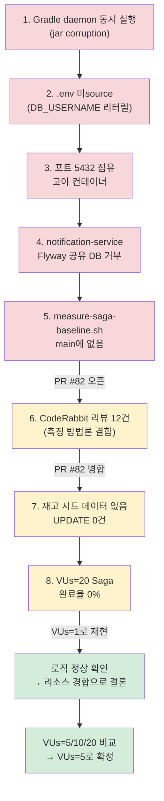

# 06. 2.20 — Saga 성능 측정 트러블슈팅

로드맵 2.20(1단계 대비 2단계 성능 비교) 실측을 로컬(Windows, Git Bash + IntelliJ +
Docker Desktop)에서 진행하며 겪은 문제와 대응을 기록한다. 결과 숫자 자체는
[benchmarks/04-saga-comparison.md](../../benchmarks/04-saga-comparison.md)에 있다 — 이
문서는 "그 숫자가 왜 이렇게 나왔는가"의 과정을 남긴다.

## 문제상황

측정 스크립트(`scripts/measure-saga-baseline.sh`)와 k6 시나리오(`k6/saga-order-flow.js`)는
이미 몇 주 전에 별도 브랜치(`claude/sharp-cannon-3biixh`)에 준비돼 있었지만 `main`에
병합된 적이 없었다. 로컬에서 실제로 5개 서비스를 띄우고 측정을 시작하자, 전혀 다른 층위의
문제 8개가 순서대로 튀어나왔다 — 인프라 기동 문제 → 측정 도구 자체의 결함 → 측정값이
의미하는 바에 대한 오판, 순으로 이어졌다.



## 목표

로드맵 2.20이 요구하는 것: 1단계(모놀리식, 동기 결제 승인)와 2단계(서비스 분리 +
Kafka Saga) 사이의 성능 트레이드오프를 실측으로 남긴다. 가설은 로드맵 자체에 이미
적혀 있었다 — "주문 API 응답은 더 이상 결제 승인을 동기로 기다리지 않으니 빨라지고,
Saga 전체 완료는 Outbox 릴레이 폴링 + Kafka 홉이 늘어나 느려질 것"(분리 후 latency는
거의 확실히 나빠진다). 이 문서가 다루는 8개 문제는 전부 "그 숫자를 신뢰할 수 있게
뽑아내는 과정"에서 생긴 것이지, 가설 검증 자체의 문제는 아니었다.

## 진행 요소

| # | 문제 | 원인 | 조치 | 근거 |
|---|---|---|---|---|
| 1 | Gradle daemon jar 손상 (`Unexpected end of ZLIB input stream`) | `./gradlew ... &`로 5개 서비스를 동시에 띄우며 공유 모듈(`common-outbox` 등) 빌드 출력에 5개 프로세스가 동시에 쓰기 경합 | 전체 `kill` → `./gradlew --stop` → `clean build -x test` 순차 1회 실행 후 재기동 | 로컬 세션 |
| 2 | `${DB_USERNAME}` 리터럴 미치환 → 인증 실패 | `.env`를 source한 터미널과 서비스를 띄운/스크립트를 실행한 터미널이 다름 (환경변수는 터미널 세션 단위) | 같은 터미널에서 `set -a && source ./.env && set +a` 후 실행 | 로컬 세션 |
| 3 | 포트 5432 점유로 `postgres-order` 기동 실패 | 2.2(서비스별 DB 분리) 이전의 레거시 단일 컨테이너 `payment-lab-postgres`가 고아로 남아 포트를 점유 | `docker ps -a --filter name=payment-lab`로 식별 → 컨테이너만 정지/삭제(볼륨은 보존) | 로컬 세션 |
| 4 | notification-service Flyway: `Found non-empty schema(s) 'public' but no schema history table` | 2.2 정책상 notification-service가 inventory-service와 물리 DB를 공유 — 이미 마이그레이션된 스키마에 처음 접속하는 입장이라 `baseline-on-migrate` 기본 동작(자기 히스토리 테이블 없이 비어있지 않은 스키마를 보면 거부)에 걸림 | `application.yml`에 `baseline-on-migrate: true` + `baseline-version: 0` 추가 — `baselineVersion=0`이 핵심: 기본값(1)을 쓰면 notification-service 자신의 V1~V3 마이그레이션까지 건너뛰어버림 | [PR #81](https://github.com/JoJimi/payment-lab/pull/81) |
| 5 | `./scripts/measure-saga-baseline.sh: No such file or directory` | 스크립트/k6 시나리오/비교 문서 4개 파일이 별도 브랜치에만 있고 `main`에 병합된 적이 없었음 | 4개 신규 파일만 골라 `main` 기준 PR로 오픈 | [PR #82](https://github.com/JoJimi/payment-lab/pull/82) |
| 6 | CodeRabbit 리뷰 Major 6건 + Minor 4건 + outside-diff 2건 — 측정 방법론 자체의 결함 (부하 동등성 미검증, 타임아웃 판정이 stale한 시각 기준, 타임아웃된 주문이 완료 시간 분포를 오염, `OrderStatus`만으로는 Saga 완료를 알 수 없음 등) | 최초 버전은 "일단 동작하는" 수준으로만 작성됨 — 부하 측정 도구 특유의 함정(닫힌 루프 모델, stale 타임스탬프, 편향된 분포)을 처음부터 고려하지 못함 | 라운드별로 수정·재리뷰 반복. 가장 큰 변경은 `OrderResponse`에 `sagaStatus` 필드 추가(프로덕션 코드 변경, 사용자 승인 하에 진행) — `OrderStatus=PAID`만으로는 재고 예약/알림 발행이 끝났는지 알 수 없어서 결제만 끝나도 "Saga 완료"로 오판하고 있었음 | PR #82 리뷰 스레드 12건, 전부 해결 |
| 7 | `UPDATE inventory ... WHERE product_id=1`이 0건 갱신 | `products`/`inventory` 마이그레이션(V1~V5)에 시드 데이터가 없음 — 신선한 DB에는 애초에 `product_id=1` 행 자체가 존재하지 않음. `inventory-service`엔 상품 생성 API도 없어(`ProductController`는 조회만 지원) 수동 INSERT가 유일한 경로 | ① 스크립트에 `RETURNING product_id` 검증 추가해 0건 갱신 시 즉시 에러 종료(조용한 무효 측정 방지) ② 측정 전 `products`/`inventory`에 `product_id=1` 행을 수동 INSERT | PR #82 마지막 커밋 |
| 8 | VUs=20에서 Saga 타임아웃 내 종결 실패율 **100%** (240건 전부), `order_api_duration`조차 평균 5~8s로 비정상적으로 느림 | 처음엔 로직 버그를 의심했으나, VUs=1로 재현하자 Saga가 2~4초 안에 정상 완료 — 로직은 정상. 원인은 로컬 데스크톱 한 대에서 JVM 4개(order/payment/inventory/notification) + mock-pg-server + Kafka + Postgres 3개 + Redis + k6(VUs=20)를 동시에 돌리며 생긴 CPU 경합 | VUs=5/10/20 비교 측정으로 이 머신이 감당하는 한계를 확인 → **VUs=5**를 공식 측정값으로 확정 | `benchmarks/04-saga-comparison.md` "VUs별 부하 한계 탐색" |

## 성과 수치

### VUs별 부하 한계 (문제 8의 근거)

| VUs | Saga 타임아웃 내 종결 실패율 | order_api_duration p50 | order_api_duration p95 |
|---|---|---|---|
| 1 | 0% | ~120ms | ~170ms |
| **5 (채택)** | **0%** | 186ms | 850ms |
| 10 | 57% | 2.37s | 6.81s |
| 20 | 100% | 5.26s | 15.98s |

```
Saga 타임아웃 실패율                 order_api_duration p95
VUs=1   ░░░░░░░░░░   0%             ▏ 0.17s
VUs=5   ░░░░░░░░░░   0%             █ 0.85s
VUs=10  ██████░░░░   57%            ████████ 6.81s
VUs=20  ██████████   100%           ███████████████████ 15.98s
```

VUs=1→5는 완만하고(실패율 0% 유지), VUs=5→10에서 급격히 무너진다 — 이 하드웨어의
한계가 5와 10 사이 어딘가에 있다는 뜻이다. `order_api_duration`(부하와 무관해야 할
단순 동기 저장 API)조차 VUs와 함께 선형 이상으로 느려지는 건, Saga 로직이 아니라
**호스트 CPU 경합**이 원인이라는 직접적 증거다.

### CodeRabbit 리뷰 대응 (문제 6의 근거)

| 구분 | 건수 | 처리 |
|---|---|---|
| Major (측정 방법론 결함) | 6건 | 전부 수정 — 부하 동등성 문서화, 타임아웃 판정 시점 수정, 편향 제거, `sagaStatus` 도입 등 |
| Minor (도구/문서 결함) | 4건 | 전부 수정 — readiness 대기 순서, k6 JSON 경로 오타, 재고 시드 검증, 테스트 커버리지 |
| outside-diff (아키텍처 지적) | 2건 | 전부 반영 — 프로덕션 API 변경(`sagaStatus`) 1건, 재고 시드 검증 1건 |
| 재검토 라운드 | 6회 | 매 수정 커밋마다 CodeRabbit이 전체 diff를 다시 리뷰 — 마지막 라운드는 "지적 사항 없음"으로 종료 |

### 최종 공식 측정값 (VUs=5, 3회 중앙값)

| 지표 | 1단계 (VUs=20) | 2단계 (VUs=5) | 비고 |
|---|---|---|---|
| 주문 API 응답 p50 | 1.63s | **0.19s** | 8배 이상 빠름 — 결제 승인을 더 이상 동기 대기하지 않음 |
| 전체 완료 p50 | 1.63s(동일 지표) | **4.93s** | saga_completion_duration — 약 3배 느림 (Outbox 릴레이 × 3홉 누적) |
| 처리율 | 9.23/s | 0.976/s | **VUs가 달라 직접 비교 불가** — 아래 주의 참고 |

**주의**: 1단계는 VUs=20, 2단계는 VUs=5에서 측정했다. 로드맵 2.20이 예고한 트레이드오프
(응답은 빨라지고 완료는 느려짐) 자체는 확인됐지만, 그 차이의 크기가 온전히 아키텍처
때문인지 부하 차이 때문인지는 이번 측정 환경(개발자 로컬 데스크톱)에서는 분리할 수
없다. 자세한 수치와 비교 caveat은 `benchmarks/04-saga-comparison.md` 참고.

## 남은 과제

- **서버급 환경에서 VUs=20 재측정**: 이번 결론(VUs=20에서 실패율 100%)은 "2단계가 느리다"가
  아니라 "이 개발자 데스크톱이 5개 서비스 + Kafka + Postgres 3개를 VUs=20까지 못 버틴다"는
  것이다. 3단계(서킷 브레이커 등) 이후 별도 서버/CI 환경에서 VUs를 맞춰 재측정하면 이
  가설을 확인할 수 있다.
- **1단계 스크립트에 end-to-end Trend 추가**: 현재 1단계 p50/p95는 개별 HTTP 요청(주문
  생성 + 결제 요청)이 섞인 값이라, 2단계 `saga_completion_duration`(반복 전체)과 엄밀히
  같은 범위가 아니다. 이미 완료된 1단계 산출물을 건드리는 일이라 이번 범위 밖으로 남겼다.
- **상품 시드 자동화**: `products`/`inventory`에 시드 데이터나 생성 API가 없어 측정마다
  수동 INSERT가 필요하다. 반복 측정이 잦아지면(3단계 이후) Flyway 시드 마이그레이션이나
  `POST /api/products` 엔드포인트를 고려할 만하다.
